# Operational Viewpoint Package
## Army COTS LEO Direct-to-Edge Imagery Concept

**Document type:** Lightweight DoDAF-inspired Operational Viewpoint package  
**System concept:** Army COTS LEO Direct-to-Edge Imagery  
**Primary research project:** `leo-edge-architecture`  
**Intended use:** IEEE Aerospace Conference architecture development, research scaffolding, systems-engineering documentation, and model traceability  
**Status:** Superseded (v1 framing) as of `docs/DECISION_LOG.md` ADR-007/ADR-009. Kept for historical reference, not deleted, the same way `results/frozen/v1/` is kept alongside `results/frozen/v2/`.
**Classification posture:** Public-source, unclassified, notional, non-operational  
**Important note:** This is **not** intended to be a formally certified DoDAF architecture package. It borrows the structure and discipline of the DoDAF Operational Viewpoint to make the concept coherent, traceable, and analytically useful.

**This document describes the pre-rework research question** (should a
satellite process imagery onboard versus on the ground) with a single,
undifferentiated "ground terminal" that is not marked as Army-owned versus
commercial. It does not reflect the current research question (allocation
of imagery functions across a commercial-LEO-provider / Army-edge-terminal
ownership boundary). For the current operational and architectural
description, read, in order: `docs/OPERATIONAL_CONTEXT.md`,
`docs/MISSION_THREADS.md`, `docs/STAKEHOLDERS.md`, and
`docs/ALLOCATION_SPACE.md`. The OV-1 concept image referenced in section 6
below is likewise retired; see `docs/OV1_SPEC.md` for what a current
concept graphic should show instead. This document was not rewritten
section-by-section in this pass; `docs/DECISION_LOG.md` ADR-009 states why.

---

# 1. Purpose

This document describes the operational architecture of a notional Army-oriented COTS low-Earth-orbit small-satellite system that delivers geospatial imagery directly to a local or mobile ground terminal.

The core concept is simple:

1. A user or mission element submits a geospatial information request.
2. Mission operations plans and schedules a collection.
3. A COTS-heavy LEO small satellite acquires imagery over an area of interest.
4. The spacecraft may process the imagery onboard.
5. The spacecraft downlinks imagery or derived products directly to a local ground terminal.
6. The local ground terminal performs additional processing as needed.
7. The user receives a usable image product faster than under a fully centralized processing chain.

The architecture is designed around the operational question:

> **How should sensing, processing, storage, downlink, and ground processing be allocated across the system to reduce time to useful imagery while respecting spacecraft power, compute, storage, and contact constraints?**

The Operational Viewpoint package is intended to answer:

- Who participates in the mission?
- What do they do?
- What information moves between them?
- In what order?
- Under what rules?
- What states does the system pass through?
- What happens during nominal and degraded operations?
- Which operational flows should later map into simulation objects, requirements, interfaces, and paper figures?

---

# 2. Scope

## 2.1 In scope

This package describes:

- Army user interaction;
- mission request generation;
- mission operations and planning;
- collection scheduling;
- LEO image collection;
- onboard image processing;
- onboard storage;
- direct downlink;
- local/mobile ground terminal operations;
- ground-side image processing;
- progressive product delivery;
- telemetry and spacecraft status;
- product dissemination;
- degraded operations;
- recovery and fallback behavior.

## 2.2 Out of scope

This package does not define:

- actual Army operational tasking procedures;
- classified collection requirements;
- tactical targeting workflows;
- weapon cueing;
- real Army network configurations;
- real operational ground terminal locations;
- classified data rates;
- detailed satellite optical design;
- detailed RF waveform design;
- cybersecurity certification;
- spectrum allocation;
- acquisition policy;
- launch operations.

---

# 3. Operational Concept Summary

The concept separates mission operations from the local edge delivery path.

A user may submit a collection request through mission operations. Mission operations validates the request, allocates spacecraft resources, and schedules collection. The LEO spacecraft executes the collection and generates one or more products.

The spacecraft may generate a hierarchy of products:

- metadata;
- thumbnail;
- quicklook;
- region-of-interest product;
- full-resolution product.

The mobile ground terminal directly receives products from the spacecraft when line-of-sight access exists.

The local ground terminal can:

- receive;
- reconstruct;
- decode;
- process;
- cache;
- display;
- forward.

The architecture preserves the option for broader enterprise dissemination without making the enterprise network part of the critical direct-to-edge path.

---

# 4. Operational Actors

| Actor | Role |
|---|---|
| Army User | Requests imagery and receives usable products |
| Mission Operations | Validates requests, plans collection, monitors mission execution |
| Spacecraft | Collects imagery, processes and stores products, performs downlink |
| Onboard Processor | Generates compressed, quicklook, ROI, or progressive products |
| Direct Edge Ground Terminal | Receives direct downlink and performs local processing |
| Ground Operator | Operates the local terminal and monitors data receipt |
| Enterprise Data Service | Optional archive and broader dissemination path |
| Additional Users | Optional recipients of completed products |
| Spacecraft Health / Telemetry Function | Reports spacecraft state to mission operations |
| Product Scheduler | Prioritizes onboard products for downlink |

---

# 5. Operational Products

The operational architecture recognizes several product tiers.

| Product Tier | Description | Operational Purpose |
|---|---|---|
| P0 Metadata | Time, footprint, product manifest, quality information | Immediate awareness and indexing |
| P1 Thumbnail | Very small low-resolution image | Fast confirmation that collection succeeded |
| P2 Quicklook | Reduced-resolution interpretable image | Early user understanding |
| P3 ROI Product | Full or near-full resolution over predeclared area | Priority delivery of most relevant area |
| P4 Full Product | Complete high-resolution image product | Full exploitation and archival use |

These product tiers are analytical abstractions and are not intended to represent formal Army product standards.

---

# 6. OV-1
# High-Level Operational Concept Graphic

## 6.1 Purpose

The OV-1 communicates the concept in one view.

It should answer:

- who is involved;
- where they are;
- what the major flows are;
- what the spacecraft does;
- how the user receives the final product.

## 6.2 OV-1 Narrative

The operational sequence is:

1. The Army user identifies a need for geospatial information.
2. Mission Operations receives and plans the request.
3. Tasking is sent to the LEO spacecraft.
4. The spacecraft collects imagery over the area of interest.
5. The spacecraft performs onboard processing if required.
6. The spacecraft directly downlinks image products to the mobile ground terminal.
7. The mobile ground terminal performs local processing.
8. The product is delivered to the requesting user.
9. Telemetry and status are returned to Mission Operations.
10. Selected products may also be passed to enterprise storage or additional users.

## 6.3 OV-1 Concept Diagram

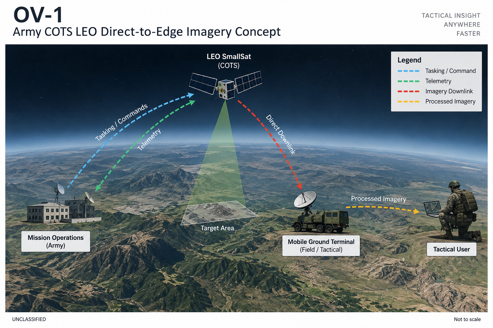

Mission Operations tasks the spacecraft and receives its telemetry. The spacecraft images the target area and downlinks directly to a mobile ground terminal in the field, which processes the product and hands it to the tactical user. The same flow is shown as a logical diagram below.

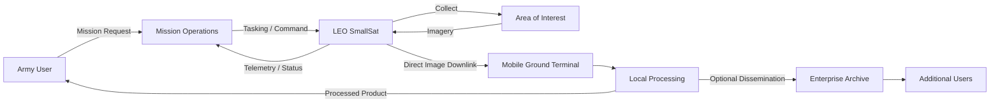

## 6.4 OV-1 Operational Message

The key message is:

> **A local user can receive useful geospatial products through a direct LEO-to-edge path without requiring every product to traverse a centralized processing chain first.**

---

# 7. OV-2
# Operational Resource Flow Description

## 7.1 Purpose

The OV-2 shows the operational nodes and the resources exchanged between them.

The emphasis is not on implementation hardware. It is on operational relationships and information/resource flows.

## 7.2 Operational Nodes

### N1 Army User
Generates geospatial data need and consumes product.

### N2 Mission Operations
Plans, schedules, commands, and monitors the mission.

### N3 LEO Spacecraft
Collects imagery and produces/transmits data products.

### N4 Direct Edge Ground Terminal
Receives spacecraft downlink and transfers received data to the local processing environment.

### N5 Local Ground Processing
Transforms received products into locally usable geospatial information.

### N6 Enterprise Archive / Distribution
Optional persistent storage and broader distribution.

### N7 Additional User
Receives products after initial mission completion.

## 7.3 OV-2 Resource Flow Diagram

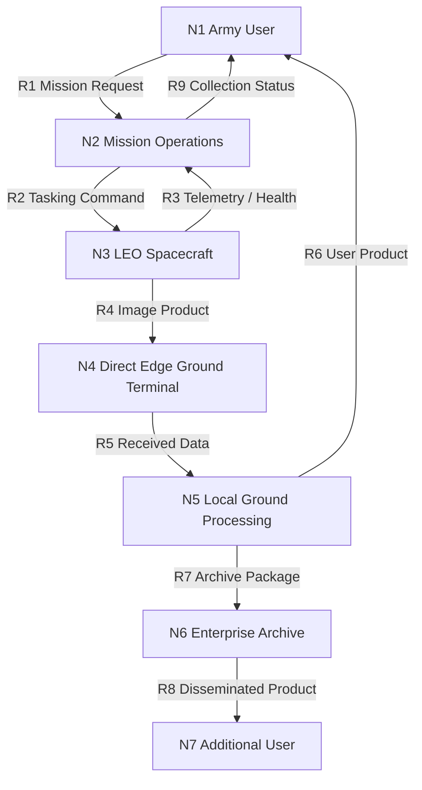

## 7.4 Operational Resource Definitions

| Flow ID | Resource | From | To | Description |
|---|---|---|---|---|
| R1 | Mission Request | User | Mission Operations | Desired collection or information need |
| R2 | Tasking Command | Mission Operations | Spacecraft | Collection timing, area, mode, priorities |
| R3 | Telemetry / Health | Spacecraft | Mission Operations | State, readiness, storage, system status |
| R4 | Image Product | Spacecraft | Edge Terminal | Raw, compressed, quicklook, ROI, or full product |
| R5 | Received Data | Edge Terminal | Ground Processing | Reassembled downlinked product |
| R6 | User Product | Ground Processing | User | Usable imagery or geospatial product |
| R7 | Archive Package | Ground Processing | Enterprise | Product plus metadata |
| R8 | Disseminated Product | Enterprise | Additional User | Broader mission distribution |
| R9 | Collection Status | Mission Operations | User | Planned, collected, pending, delivered |

## 7.5 Key OV-2 Insight

The critical direct path is:

```text
User Need
→ Mission Operations
→ Spacecraft
→ Edge Terminal
→ User
```

The enterprise archive is optional to immediate mission completion.

---

# 8. OV-3
# Operational Resource Flow Matrix

## 8.1 Purpose

The OV-3 turns OV-2 into a matrix so that every exchange can be checked for completeness.

## 8.2 Resource Flow Matrix

| From / To | Army User | Mission Ops | LEO Spacecraft | Edge Terminal | Ground Processing | Enterprise | Additional Users |
|---|---|---|---|---|---|---|---|
| Army User | - | Mission Request | - | - | - | - | - |
| Mission Ops | Collection Status | - | Tasking / Command | - | - | - | - |
| LEO Spacecraft | - | Telemetry / Health | - | Image Product | - | - | - |
| Edge Terminal | - | Terminal Status | - | - | Received Data | - | - |
| Ground Processing | User Product | - | - | - | - | Archive Package | - |
| Enterprise | - | Archive Status | - | - | - | - | Disseminated Product |
| Additional Users | - | - | - | - | - | - | - |

## 8.3 Flow Characteristics Matrix

| Flow | Priority | Timing Sensitivity | Typical Size | Reliability Need | Notes |
|---|---|---|---|---|---|
| Mission Request | High | Moderate | Very small | High | Drives mission planning |
| Tasking Command | High | High | Very small | Very high | Must arrive before collection |
| Telemetry / Health | Medium | Moderate | Small | High | Supports planning and fault awareness |
| Thumbnail | High | High | Very small | High | Early user value |
| Quicklook | High | High | Small/medium | High | Primary early product |
| ROI Product | High | High | Medium | High | Priority image subset |
| Full Product | Medium | Lower | Large | Medium/high | Can be completed later |
| Archive Package | Medium | Low | Large | High | Persistence and reuse |
| Status Update | Medium | Moderate | Very small | High | User awareness |

## 8.4 Resource Flow Timing Categories

### Immediate
- tasking command;
- collection status;
- metadata;
- thumbnail.

### Near-real-time
- quicklook;
- ROI product;
- telemetry.

### Deferred
- full product;
- enterprise archive;
- broader dissemination.

## 8.5 Key OV-3 Insight

Not all operational flows have equal urgency.

The architecture should prioritize small high-value products ahead of large low-urgency products when contact capacity is constrained.

---

# 9. OV-4
# Organizational Relationships Chart

## 9.1 Purpose

The OV-4 shows who coordinates with whom.

This is organizationally notional and should not be interpreted as an actual Army command relationship.

## 9.2 Organizational View

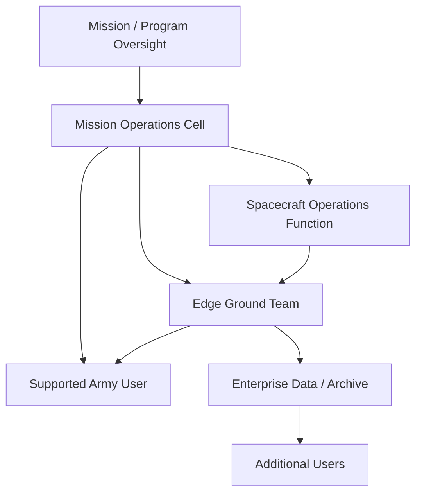

## 9.3 Relationship Types

| Relationship | Description |
|---|---|
| Requesting | User requests mission support |
| Planning | Mission Operations translates request into executable mission plan |
| Commanding | Mission Operations issues tasking to spacecraft |
| Monitoring | Mission Operations receives telemetry and mission status |
| Receiving | Ground team receives spacecraft data |
| Processing | Ground team converts received data into usable products |
| Supporting | Ground team supports user delivery |
| Archiving | Enterprise stores completed products |
| Disseminating | Enterprise distributes to additional users |

## 9.4 Organizational Principle

The architecture deliberately separates:

- mission authority;
- spacecraft operations;
- ground reception;
- user exploitation.

That separation prevents the OV package from implying that one tactical user directly controls all spacecraft functions.

---

# 10. OV-5a
# Operational Activity Decomposition Tree

## 10.1 Purpose

OV-5a decomposes the mission into activities.

## 10.2 Top-Level Activity

**A0: Provide Direct-to-Edge LEO Geospatial Product**

## 10.3 Activity Decomposition

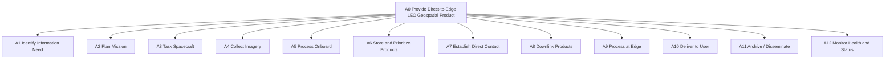

## 10.4 Second-Level Decomposition

### A1 Identify Information Need
- A1.1 identify area of interest;
- A1.2 identify requested product;
- A1.3 identify desired delivery time;
- A1.4 submit request.

### A2 Plan Mission
- A2.1 validate request;
- A2.2 check spacecraft availability;
- A2.3 check orbit/access opportunity;
- A2.4 allocate spacecraft resources;
- A2.5 schedule collection;
- A2.6 schedule ground contact.

### A3 Task Spacecraft
- A3.1 generate command;
- A3.2 transmit command;
- A3.3 verify receipt;
- A3.4 update mission status.

### A4 Collect Imagery
- A4.1 maneuver / prepare payload;
- A4.2 acquire scene;
- A4.3 validate acquisition;
- A4.4 store raw data.

### A5 Process Onboard
- A5.1 inspect spacecraft resource state;
- A5.2 select processing mode;
- A5.3 generate metadata;
- A5.4 generate thumbnail;
- A5.5 generate quicklook;
- A5.6 generate ROI product if required;
- A5.7 generate compressed/full product.

### A6 Store and Prioritize Products
- A6.1 register product;
- A6.2 assign priority;
- A6.3 estimate next contact capacity;
- A6.4 queue products;
- A6.5 remove expired or completed products.

### A7 Establish Direct Contact
- A7.1 predict pass;
- A7.2 configure radio;
- A7.3 establish link;
- A7.4 confirm ground terminal readiness.

### A8 Downlink Products
- A8.1 transmit metadata;
- A8.2 transmit early product;
- A8.3 transmit ROI or priority tiles;
- A8.4 transmit full product chunks;
- A8.5 resume incomplete product if needed.

### A9 Process at Edge
- A9.1 reassemble data;
- A9.2 decode;
- A9.3 perform local post-processing;
- A9.4 validate product;
- A9.5 prepare user display.

### A10 Deliver to User
- A10.1 notify user;
- A10.2 present product;
- A10.3 capture completion status.

### A11 Archive / Disseminate
- A11.1 store final product;
- A11.2 store metadata;
- A11.3 disseminate to approved additional users.

### A12 Monitor Health and Status
- A12.1 monitor spacecraft health;
- A12.2 monitor storage;
- A12.3 monitor energy;
- A12.4 monitor communications;
- A12.5 monitor processor availability;
- A12.6 report degraded state.

---

# 11. OV-5b
# Operational Activity Model

## 11.1 Purpose

OV-5b shows the sequence and dependencies among operational activities.

## 11.2 Nominal Operational Activity Flow


## 11.3 Decision-Oriented Activity Flow

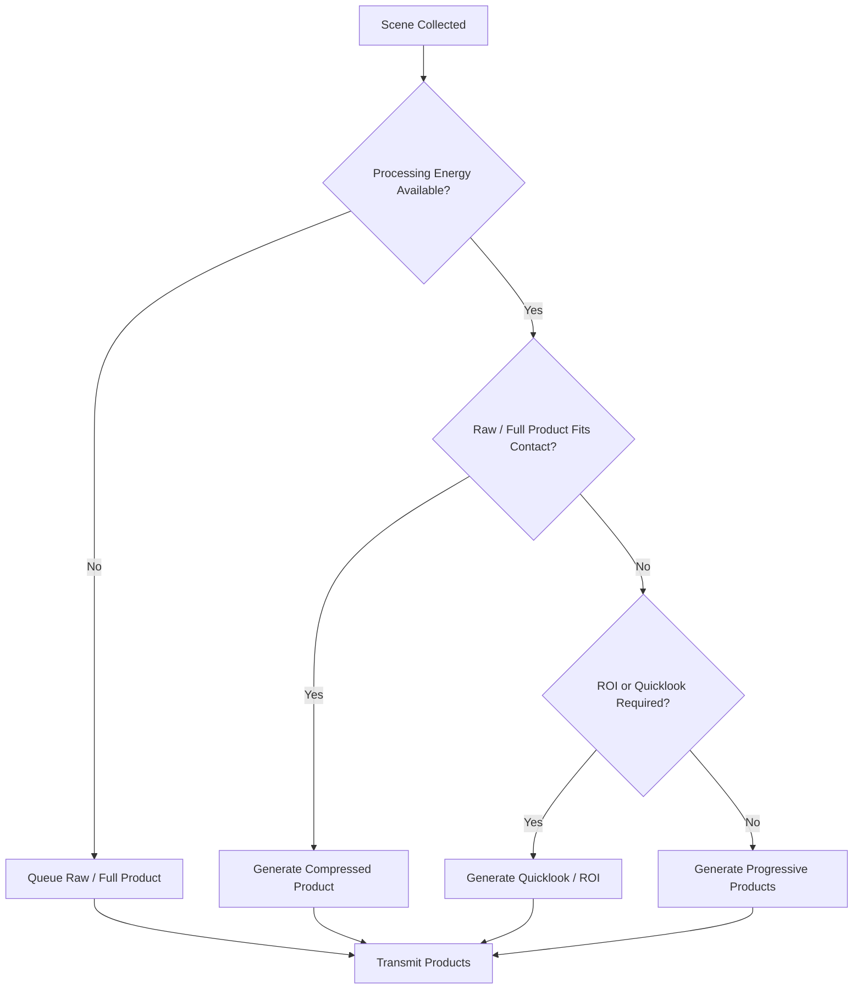

## 11.4 Activity Inputs and Outputs

| Activity | Inputs | Outputs |
|---|---|---|
| Identify Need | mission context | mission request |
| Plan Mission | request, orbit, spacecraft state | mission plan |
| Task Spacecraft | mission plan | command set |
| Collect Imagery | command, payload readiness | raw scene |
| Select Processing | raw scene, energy, storage, contact forecast | processing decision |
| Process Onboard | raw scene | derived products |
| Queue Products | products, priorities | ordered product queue |
| Establish Contact | orbit geometry, terminal availability | active downlink |
| Downlink | product queue, link | received product data |
| Ground Process | received product | usable image product |
| Deliver | usable product | user access |
| Archive | final product | persistent storage |

---

# 12. OV-6a
# Operational Rules Model

## 12.1 Purpose

OV-6a identifies operational rules that constrain system behavior.

These are conceptual rules for the research architecture.

## 12.2 Mission Request Rules

**OR-001**  
A mission request shall include a defined area of interest or collection region.

**OR-002**  
A mission request shall identify a required product class or minimum useful product.

**OR-003**  
Mission Operations shall validate that an executable collection opportunity exists before tasking.

**OR-004**  
A user request shall not directly override spacecraft safety constraints.

## 12.3 Collection Rules

**OR-010**  
The spacecraft shall only collect imagery when the payload and spacecraft are in an allowable mission state.

**OR-011**  
The spacecraft shall retain acquisition metadata for each collected scene.

**OR-012**  
If the primary image product cannot be generated, the spacecraft should preserve a fallback raw or minimally processed product when feasible.

## 12.4 Onboard Processing Rules

**OR-020**  
Onboard processing shall not violate spacecraft energy limits.

**OR-021**  
Onboard processing shall not exceed available storage limits.

**OR-022**  
Processing shall be bypassable.

**OR-023**  
The architecture shall preserve a path for direct raw or minimally processed downlink.

**OR-024**  
If a reduced product can satisfy the minimum user requirement within the predicted contact capacity, the scheduler may prioritize that reduced product.

**OR-025**  
If processing delay is expected to exceed the transmission time saved, onboard processing should not be selected solely for latency reduction.

## 12.5 Product Priority Rules

**OR-030**  
Metadata shall be assigned the highest transmission priority.

**OR-031**  
A thumbnail or quicklook product may be transmitted before the full product.

**OR-032**  
A predeclared ROI product may be transmitted before the remainder of the image.

**OR-033**  
Incomplete low-priority full products may resume during a later contact.

**OR-034**  
A completed high-priority product shall not be delayed solely to maximize total contact utilization.

## 12.6 Contact Rules

**OR-040**  
Direct downlink may occur only during valid line-of-sight contact.

**OR-041**  
The scheduler shall not plan more transmitted data than the predicted contact capacity without an explicit margin policy.

**OR-042**  
Actual transmitted bytes shall not exceed actual contact capacity.

**OR-043**  
Loss of contact shall pause or terminate transfer according to file/chunk state.

## 12.7 Ground Processing Rules

**OR-050**  
The ground terminal shall validate product integrity before declaring completion.

**OR-051**  
A partial product may be made available to the user if it meets the defined minimum useful product threshold.

**OR-052**  
Full product completion may occur after the first useful product is already delivered.

## 12.8 Degraded Operations Rules

**OR-060**  
If the onboard processor is unavailable, the system shall use a bypass path if storage and link resources permit.

**OR-061**  
If spacecraft energy is constrained, high-compute product generation may be suspended.

**OR-062**  
If storage occupancy exceeds a threshold, the spacecraft may prioritize smaller products or expire lower-priority data.

**OR-063**  
If the direct ground terminal is unavailable, the product may remain queued for a later contact or use an alternate approved ground path if available.

---

# 13. OV-6b
# State Transition Description

## 13.1 Purpose

OV-6b describes the operational states of the mission and their transitions.

## 13.2 Mission-Level State Model

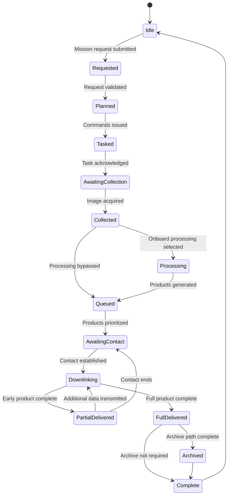

## 13.3 Spacecraft Data-State Model

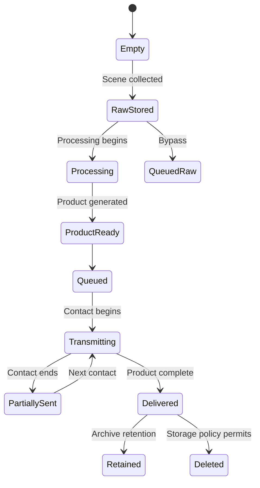

## 13.4 Spacecraft Processing Mode States

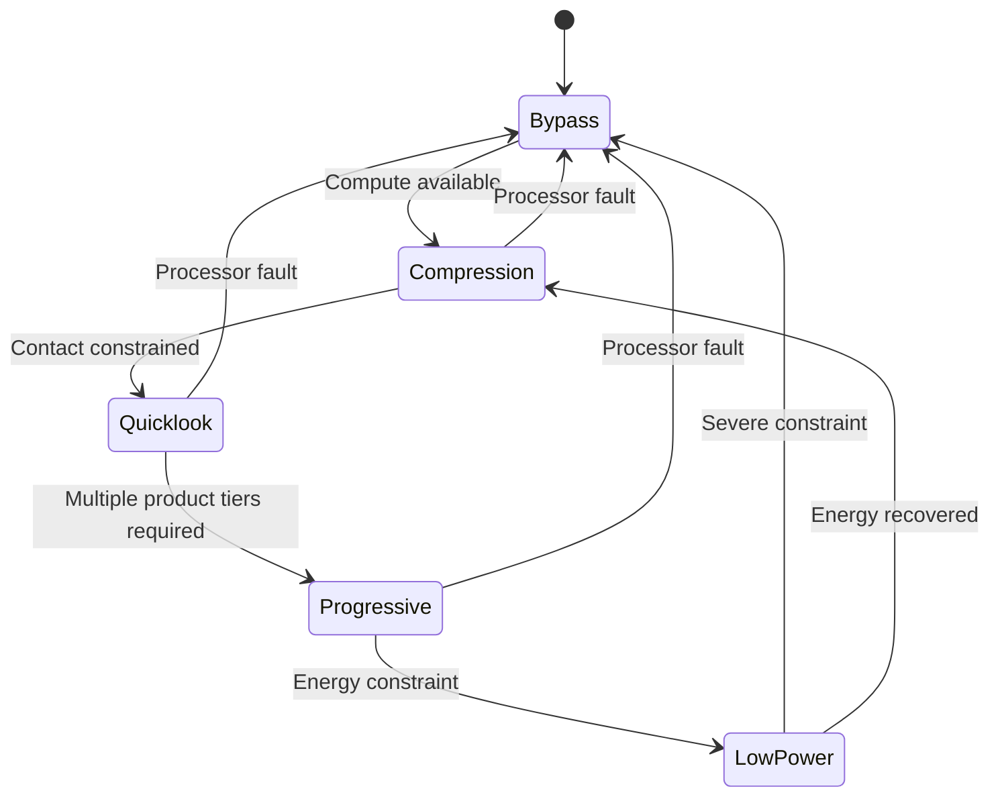

## 13.5 Ground Terminal States

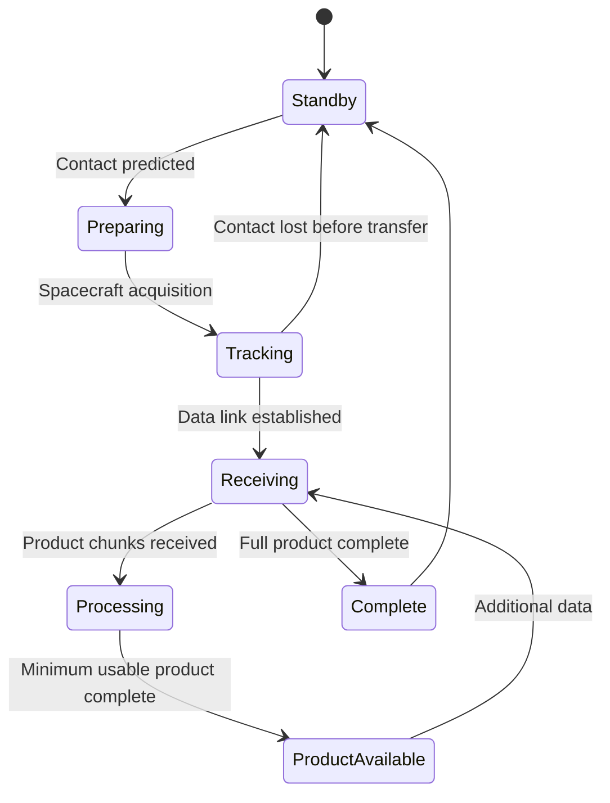

## 13.6 Mission Failure / Recovery States

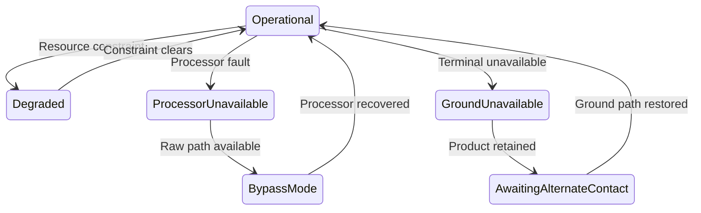

---

# 14. OV-6c
# Event-Trace Description

## 14.1 Purpose

OV-6c describes time-ordered interactions among participants.

Several event traces are included because one sequence is not enough to describe the concept.

---

# 15. OV-6c Trace 1
# Nominal Quicklook-First Mission

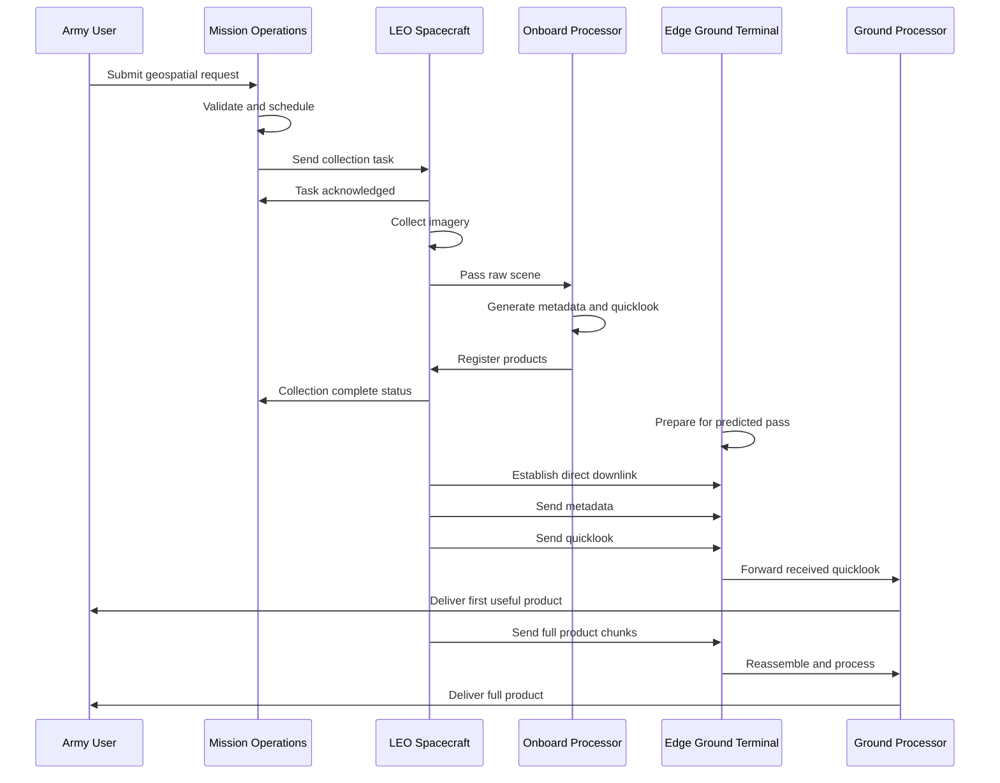

### Key timing points

- T0: request submitted;
- T1: task sent;
- T2: image collected;
- T3: quicklook generated;
- T4: contact begins;
- T5: first useful product delivered;
- T6: full product delivered.

Primary research metric:

\[
TFUP = T5 - T2
\]

---

# 16. OV-6c Trace 2
# Raw / Ground-Only Mission

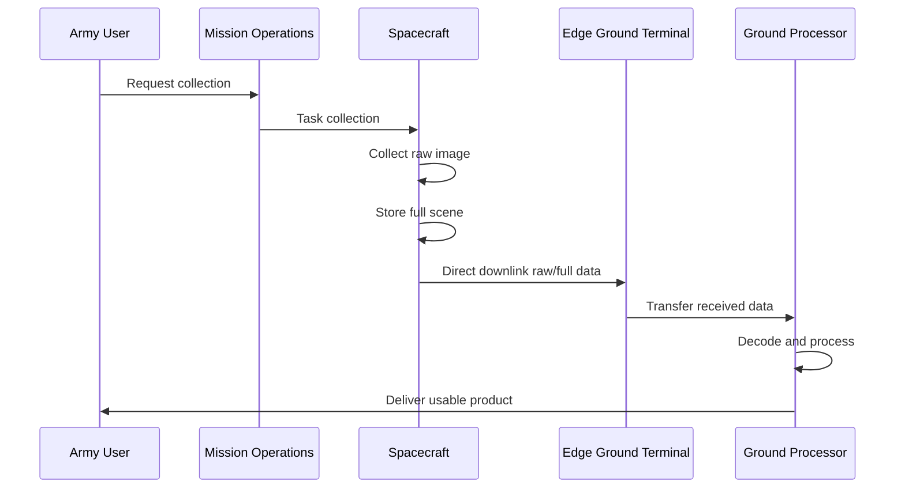

### Operational implication

The ground-only architecture minimizes onboard complexity but may delay the first usable product when the full image does not fit rapidly through the contact.

---

# 17. OV-6c Trace 3
# Contact-Constrained Progressive Delivery

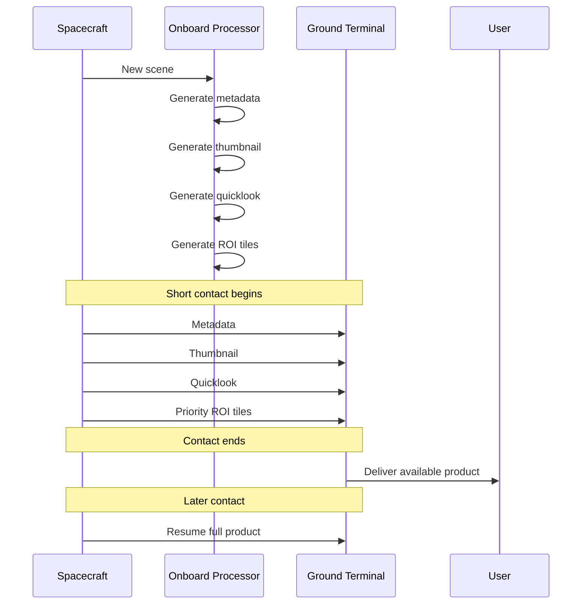

### Operational implication

The mission can deliver partial but useful value even when the contact is too short to transmit the full scene.

---

# 18. OV-6c Trace 4
# Low-Power Degraded Operation

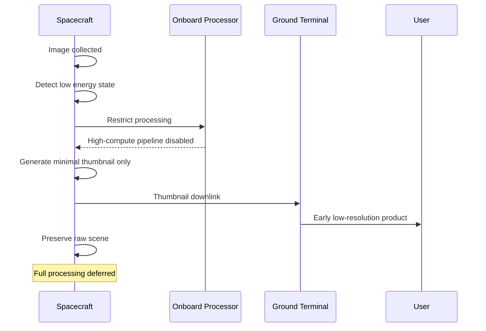

### Operational implication

A graceful-degradation mode preserves user value without violating spacecraft energy constraints.

---

# 19. OV-6c Trace 5
# Processor Failure / Bypass

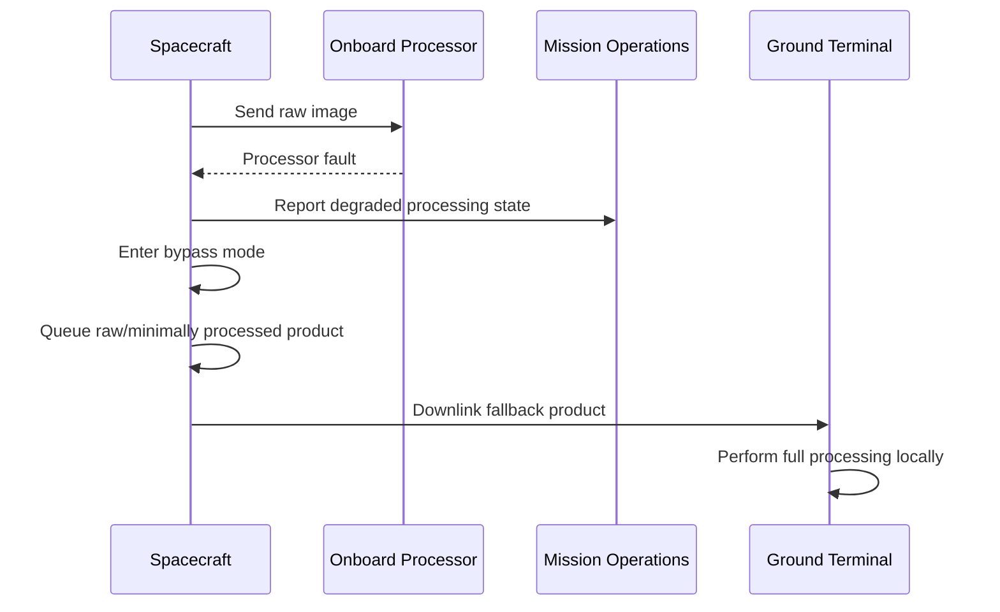

### Operational implication

Onboard processing is not a single point of failure for the imagery mission.

---

# 20. OV-6c Trace 6
# Ground Terminal Unavailable

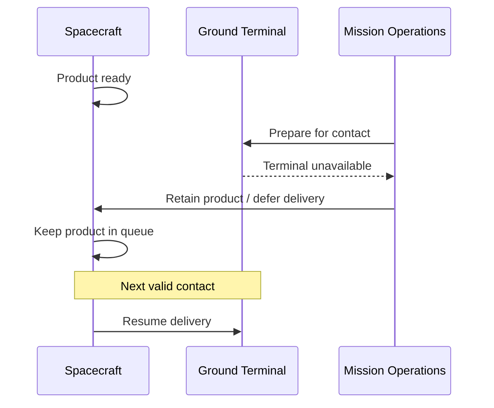

---

# 21. Operational Threads

Operational threads connect multiple OV products.

## Thread T1
### Request to First Useful Product

```text
Army User
→ Mission Request
→ Mission Operations
→ Spacecraft Tasking
→ Collection
→ Quicklook Generation
→ Direct Downlink
→ Edge Processing
→ User
```

Primary metric:
TFUP.

## Thread T2
### Request to Full Product

```text
Army User
→ Mission Operations
→ Spacecraft
→ Full Product Generation
→ Direct Downlink
→ Edge Processing
→ Full Product Delivery
```

Primary metric:
TCP.

## Thread T3
### Health and Mission Awareness

```text
Spacecraft
→ Telemetry
→ Mission Operations
→ Mission Status
→ User
```

## Thread T4
### Archive and Broader Dissemination

```text
Ground Processing
→ Enterprise Archive
→ Additional Users
```

## Thread T5
### Degraded Processing

```text
Processor Fault
→ Bypass
→ Raw Product
→ Ground Processing
→ User
```

---

# 22. Operational Performance Measures

The operational views should connect to measurable research outputs.

| Measure | Operational Question |
|---|---|
| Time to First Useful Product | How fast does the user receive something usable? |
| Time to Complete Product | How fast is the entire product available? |
| Deadline Satisfaction | Does the product arrive when required? |
| Contact Utilization | How efficiently is the pass used? |
| Product Completeness | How much of the requested product is delivered? |
| Storage Backlog | Is the spacecraft accumulating undelivered data? |
| Processing Energy | How much spacecraft energy is used to reduce data? |
| Transmission Energy | How much energy is spent on downlink? |
| Product Age | How old is the imagery when delivered? |
| Degraded-Mode Success | Can useful output still be delivered during faults? |

---

# 23. Operational Need to Metric Traceability

| Operational Need | Operational Activity | Resource Flow | Metric |
|---|---|---|---|
| Fast initial awareness | Generate quicklook | Quicklook Product | TFUP |
| High-fidelity product | Generate full product | Full Product | TCP |
| Operate under short contacts | Prioritize products | Product Queue | Contact Utilization |
| Avoid storage saturation | Manage queue/storage | Product Data | Backlog |
| Preserve mission under faults | Bypass processing | Raw Product | Degraded Success |
| Support local user | Direct downlink | User Product | Delivery Latency |

---

# 24. Operational Information Exchange Requirements

These are not formal IERs, but they function similarly.

## IER-01 Mission Request
Source: User  
Destination: Mission Operations  
Content:
- area;
- desired product;
- timing;
- priority.

## IER-02 Tasking Command
Source: Mission Operations  
Destination: Spacecraft  
Content:
- collection time;
- collection area;
- processing mode constraints;
- contact plan.

## IER-03 Spacecraft Telemetry
Source: Spacecraft  
Destination: Mission Operations  
Content:
- system state;
- energy state;
- storage;
- processor health;
- radio state.

## IER-04 Direct Product Downlink
Source: Spacecraft  
Destination: Edge Ground Terminal  
Content:
- metadata;
- image product;
- chunk sequence;
- integrity information.

## IER-05 User Product
Source: Edge Processing  
Destination: User  
Content:
- quicklook;
- ROI;
- full product.

## IER-06 Archive Product
Source: Ground Processing  
Destination: Enterprise Archive  
Content:
- full or derived product;
- metadata;
- provenance.

---

# 25. Operational Constraints

## 25.1 Spacecraft Constraints

- finite power;
- finite storage;
- finite compute;
- finite radio time;
- finite contact opportunity.

## 25.2 Ground Constraints

- line-of-sight requirement;
- finite processing throughput;
- finite storage;
- terminal availability.

## 25.3 Mission Constraints

- collection timing;
- user deadline;
- orbit geometry;
- product priority.

---

# 26. Operational Assumptions

**OA-001**  
The system uses one or more COTS-heavy LEO small satellites.

**OA-002**  
The mobile ground terminal has direct visibility to the spacecraft during valid passes.

**OA-003**  
The edge terminal can perform local processing.

**OA-004**  
Onboard processing is optional and can be bypassed.

**OA-005**  
The spacecraft maintains onboard storage sufficient to retain at least one representative scene.

**OA-006**  
Mission Operations can predict contact opportunities with useful accuracy.

**OA-007**  
The direct ground terminal is not continuously connected to the spacecraft.

**OA-008**  
The user may benefit from a reduced-resolution product before the full product arrives.

**OA-009**  
Enterprise storage is optional to immediate tactical delivery.

**OA-010**  
Operational performance thresholds in the simulation are analytical, not actual Army requirements.

---

# 27. Operational Risks

| Risk | Operational Effect | Mitigation |
|---|---|---|
| Short contact | Full product incomplete | Progressive delivery |
| Processor fault | No onboard reduction | Bypass mode |
| Low battery | Processing unavailable | Minimal product mode |
| Storage saturation | New collections blocked | Product priority / deletion |
| Ground outage | Missed pass | Defer or alternate path |
| Incorrect contact forecast | Incomplete planned transfer | Safety margin |
| Ground processing bottleneck | User latency | Local compute scaling |
| Large scene volume | Backlog | Compression / ROI / progressive |
| Poor product prioritization | Valuable product delayed | Explicit priority rules |

---

# 28. Operational Scenarios

## Scenario S1
### Nominal Direct Delivery

- mission request accepted;
- collection succeeds;
- quicklook produced;
- direct contact occurs;
- quicklook delivered;
- full product follows.

## Scenario S2
### Full Product Fits One Contact

- image collected;
- compressed full product generated;
- complete product delivered in one pass.

## Scenario S3
### Full Product Does Not Fit

- image collected;
- progressive products generated;
- early product delivered in pass 1;
- full product completed in later pass.

## Scenario S4
### Low Energy

- collection succeeds;
- energy insufficient for high-compute pipeline;
- thumbnail or raw product used;
- processing deferred.

## Scenario S5
### High Backlog

- several scenes await transmission;
- queue prioritizes recent or high-priority products;
- low-priority full products are delayed.

## Scenario S6
### Processor Failure

- onboard processing unavailable;
- raw product preserved;
- ground terminal performs processing.

## Scenario S7
### Ground Terminal Unavailable

- spacecraft holds product;
- mission operations schedules later opportunity;
- product delivered later.

---

# 29. Operational Decision Points

## D1
Can the mission request be satisfied by available orbit geometry?

## D2
Does the spacecraft have enough power to process onboard?

## D3
Does the desired product fit in the next contact?

## D4
Is an early product required?

## D5
Does the full scene need to be retained?

## D6
Is direct ground terminal access available?

## D7
Should the product be archived after delivery?

---

# 30. Operational Architecture Principles

## Principle 1
Direct delivery should reduce dependency on central infrastructure.

## Principle 2
Onboard processing should be beneficial, not mandatory.

## Principle 3
Early useful information may be more important than immediate full-product completion.

## Principle 4
The architecture should degrade gracefully.

## Principle 5
Spacecraft safety and resource constraints override product-processing ambition.

## Principle 6
The enterprise path should augment rather than block local delivery.

## Principle 7
The system should distinguish mission completion from full archive completion.

---

# 31. Cross-View Traceability

| Operational Concept | OV-1 | OV-2 | OV-3 | OV-4 | OV-5 | OV-6 |
|---|---|---|---|---|---|---|
| User submits request | yes | R1 | matrix | user/ops | A1/A2 | Trace 1 |
| Spacecraft tasking | yes | R2 | matrix | ops/sat | A3 | Trace 1 |
| Imagery collection | yes | internal | - | sat | A4 | state |
| Onboard processing | yes | internal | - | sat | A5 | rules/state |
| Product prioritization | implicit | R4 | product flows | sat/ground | A6 | rules |
| Direct downlink | yes | R4 | matrix | sat/ground | A7/A8 | traces |
| Local ground processing | yes | R5/R6 | matrix | ground/user | A9 | traces |
| First useful product | yes | R6 | matrix | ground/user | A10 | Trace 1 |
| Full product | yes | R6 | matrix | ground/user | A10 | Trace 2 |
| Archive | optional | R7 | matrix | enterprise | A11 | Trace 1 |
| Degraded processing | optional | alternate | alternate | sat/ground | A5/A8 | Traces 4/5 |

---

# 32. Suggested Follow-On Architecture Views

Although this document focuses on operational viewpoints, the following follow-on views would strengthen the project.

## Systems View
Map operational activities to physical components:

- payload;
- onboard processor;
- OBC;
- storage;
- radio;
- ground receiver;
- ground processor.

## Data View
Define:

- image product schema;
- metadata;
- product state;
- queue entry;
- contact state;
- telemetry state.

## Standards View
Document:

- image formats;
- transport assumptions;
- time standards;
- coordinate standards;
- file/chunk handling.

## Capability View
Map capabilities:

- collect;
- process;
- prioritize;
- downlink;
- deliver;
- archive.

---

# 33. Recommended Next Documents

After this Operational Viewpoint package, build:

1. `SYSTEM_ARCHITECTURE.md`
2. `INTERFACE_CONTROL_CONCEPT.md`
3. `DATA_MODEL.md`
4. `REQUIREMENTS.md`
5. `ASSUMPTIONS.md`
6. `EXPERIMENT_DESIGN.md`
7. `V_AND_V.md`
8. `RISK_REGISTER.md`
9. `PAPER_FIGURE_PLAN.md`

---

# 34. Recommended Research Mapping

The operational architecture should map directly into the simulator.

| Operational Element | Simulation Object |
|---|---|
| User Request | `MissionRequest` |
| Spacecraft | `SpacecraftState` |
| Product | `Product` |
| Contact | `ContactWindow` |
| Product Queue | `ProductQueue` |
| Processing Mode | `Policy` |
| Ground Terminal | `GroundTerminal` |
| User Delivery | `DeliveryEvent` |
| Telemetry | `SpacecraftState` logs |

---

# 35. Suggested Repository Placement

```text
docs/
├── OPERATIONAL_VIEWPOINTS.md
├── OV1/
│   └── ov1.png
├── architecture/
│   ├── SYSTEM_CONTEXT.md
│   ├── FUNCTIONAL_ARCHITECTURE.md
│   └── PHYSICAL_ARCHITECTURE.md
└── traceability/
    ├── REQUIREMENTS_TRACEABILITY.md
    └── OPERATIONAL_TO_SIMULATION.md
```

---

# 36. Final Operational Story

The simplest operational story for the concept is:

> An Army user requests geospatial information. Mission Operations schedules a collection and tasks a COTS-heavy LEO spacecraft. The spacecraft collects imagery and determines how much processing should occur onboard based on available time, power, storage, and contact capacity. Small, high-priority products can be generated first and downlinked directly to a mobile ground terminal. The terminal performs local processing and delivers an early product to the user while larger products continue to arrive. If onboard processing is unavailable, the system can bypass it and preserve the mission through ground processing.

That story should remain recognizable in every later architecture product.

---

# 37. Operational Viewpoint Package Summary

This lightweight Operational Viewpoint package defines:

- **OV-1:** the overall direct-to-edge operational concept;
- **OV-2:** operational nodes and resource flows;
- **OV-3:** resource-flow matrix;
- **OV-4:** notional organizational relationships;
- **OV-5a:** activity decomposition;
- **OV-5b:** activity sequencing and decisions;
- **OV-6a:** operational rules;
- **OV-6b:** system and mission states;
- **OV-6c:** nominal and degraded event traces.

Together, these views provide enough structure to support:

- simulation development;
- research design;
- interface definition;
- requirements allocation;
- experiment planning;
- IEEE Aerospace paper figures;
- future SysML/MBSE work.

They intentionally stop short of a formal DoDAF package while preserving the most useful operational architecture discipline.
