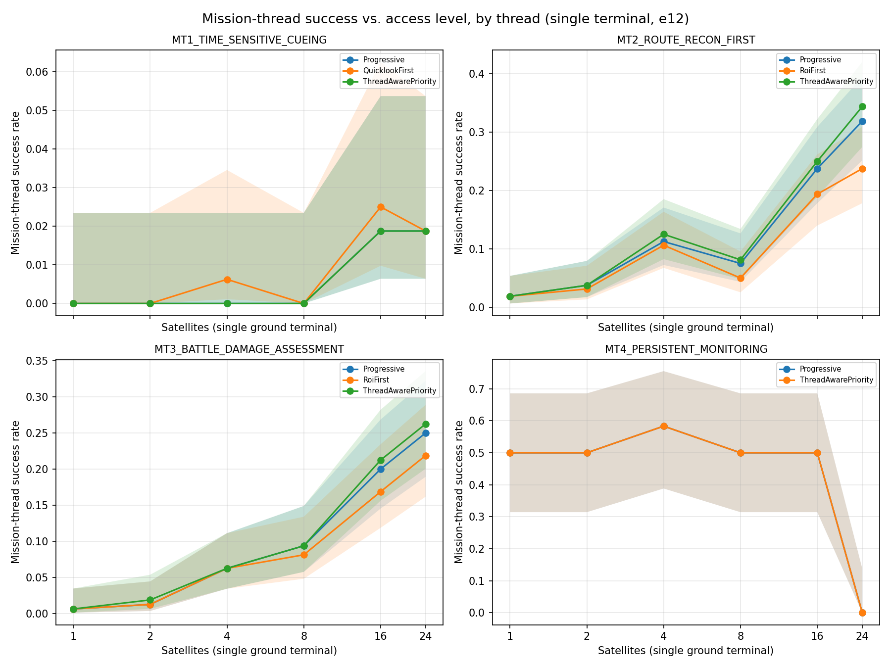
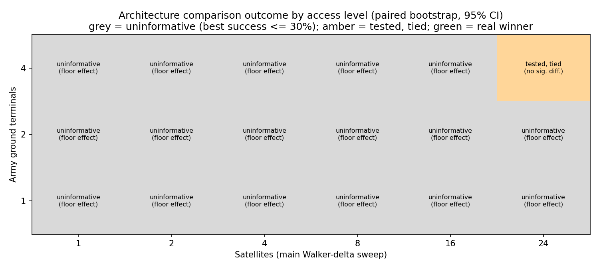

# LEO Edge Architecture

**Everything in this repository is notional and unofficial. It does not
represent an Army requirement, program, doctrine position, or acquisition
decision.**

A reproducible systems-architecture study: the Army increasingly consumes
imagery from commercial LEO providers while owning its own tactical edge
ground terminals. How should imagery functions (tasking, collection,
processing, prioritization, delivery) be allocated between the commercial
space segment and the Army-owned edge segment, and how does the preferred
allocation shift with mission need, terminal class, and contested
conditions?

`docs/OPERATIONAL_CONTEXT.md` grounds that question in three real, publicly
documented Army programs (Remote Ground Terminal, TITAN, Next Generation
Tactical Terminal) without claiming to model any of them.

## The allocation decision space

`docs/ALLOCATION_SPACE.md` is the central document: it defines the
decisions (processing allocation, tasking path, product prioritization,
policy adaptivity), places the seven architectures this repository
evaluates (A0-A6) as points within that space, and states plainly which
regions (split processing, terminal-class-dependent allocation,
change-detection support) still aren't covered. Mission-thread-aware
prioritization (A6) used to be on that list; it's now covered, with a
result.

`docs/STAKEHOLDERS.md`, `docs/REQUIREMENTS.md` (with a full traceability
matrix), and `docs/FUNCTIONAL_ARCHITECTURE.md` round out the systems
architecture; `docs/ARCHITECTURE_VIEWS.md` has the diagrams.

## The headline result: access moves success most; tiering is necessary; architecture starts to matter once access is high

`experiments/e12_access_sweep.py` sweeps real Walker-delta constellations
(every satellite propagated individually with SGP4) from 1 to 24
satellites and 1 to 4 Army ground terminals, with same-pass
collect-and-downlink allowed, and tests architecture differences only in
cells where the best architecture succeeds more than 30% of the time.

- **Access dominates in magnitude.** The best architecture's pooled
  mission-thread success rises from about 3% (1 satellite) to about 31%
  (24 satellites, 8 planes, 4 terminals). It never reached 50% and was
  still rising when the sweep stopped at 24 satellites, so the access level
  where success becomes "substantial" is not found here.
- **Tiering is necessary.** Raw downlink, compressed-full, and the
  contact-aware policy score 0% everywhere: none produces an early tier.
- **Architecture matters once access is high enough to test it.** In the
  one informative cell (24 satellites, 4 terminals), ThreadAwarePriority
  (31.2%) and Progressive (30.8%) tie, and both beat RoiFirst by about 7
  points and everything else by 24-31 points. The other 20 of 21 cells are
  uninformative (nothing works well enough to compare). This is thin
  evidence from one cell.

`docs/ACQUISITION_IMPLICATIONS.md` draws out what that means. `docs/V3_VS_V4.md`,
`docs/V2_VS_V3.md`, and `docs/V1_VS_V2.md` document how the findings changed:
v1 had a correctness bug (uncapped byte counts scored failed deliveries as
successes); v2 fixed that; v3 added statistical testing but modeled
satellites as time-shifted copies and forbade same-pass delivery, so its
"architecture is second-order" headline and its 32-satellite explanation
are retracted; v4 uses real constellations and same-pass delivery, and its
own first sweep was discarded and rerun after a TLE formatting bug was
found (`docs/DECISION_LOG.md` ADR-024).

## System architecture


A commercial LEO satellite images an area of interest, optionally tiers
the product onboard, and downlinks during a contact window to an Army-
owned tactical edge terminal, either directly or through a rear-echelon
tasking cell. `docs/ARCHITECTURE_VIEWS.md` has the full view set (OV-2
resource flows, OV-5b activities per mission thread, OV-6c event trace,
and the 4+1 software views); `docs/OV1_SPEC.md` describes what a concept
graphic for the recommended allocation should show (no image is generated
by this repository; the old OV-1 concept graphic predates this rework's
research question and is retired).

## The access/revisit sweep





`docs/V2_VS_V3.md` has the full pooled-success-rate table and every
ASSUMED value behind these two figures, including a real, documented
limitation of the phase-offset satellite model used here (single orbital
plane, not multiple planes) that explains why success rate rises then
falls at the highest satellite counts even though total contact coverage
keeps rising.

## Single-contact-window regime map

Within one contact window, which architecture completes fastest still
depends heavily on rate and contact duration:


Grid cells marked "no completion" are exactly that: no architecture
delivered a complete product within that single window, honestly reported
instead of a fabricated completion time (`docs/DECISION_LOG.md` ADR-008).
This is single-window evidence, distinct from the multi-contact mission-
thread-success result above; `docs/MODEL_REFERENCE.md` explains how the
two relate.

## Novelty

`docs/NOVELTY.md` includes a real, verified literature scan (ten sources,
each cited with a title and URL, found this session) and states honestly
where this repository's contribution does and doesn't distinguish itself
from that literature.

## Quick start

```bash
uv sync
uv run pytest
make experiments
make figures
make trade_study
```

`make experiments` runs `e00` through `e11`, including the mission-thread
Monte Carlo; run `experiments/e12_access_sweep.py` directly for the access
sweep (it isn't in the default `make experiments` loop yet, since it's
slower than a single experiment). `make trade_study` regenerates the
weighted scores in `docs/TRADE_STUDY.md` from that output. `make
reproduce` runs the first four. See `REPRODUCE_LOG.md` for a real run log.

## Repository map

| Path | What's there |
|---|---|
| `src/leo_edge/` | The architecture, orbit, imagery, metrics, mission-thread, and stats model |
| `experiments/` | `e00` through `e12`, each answering one question about the model |
| `results/frozen/v2/` | Frozen results from the v2 pass, kept as a historical record (`docs/V1_VS_V2.md`) |
| `results/frozen/v4/` | Current frozen results (`docs/V3_VS_V4.md` explains what changed; v2/v3 kept as history) |
| `figures/` | Figures generated from `results/frozen/v4/`, see `figures/README.md` |
| `docs/` | Operational context, stakeholders, requirements, allocation space, trade study, acquisition implications, architecture views, novelty, assumptions, decisions, hand-calculation check |
| `app/dashboard.py` | A Streamlit dashboard for exploring the architectures interactively |

## License

Public source, unclassified, MIT licensed. See `LICENSE`.
