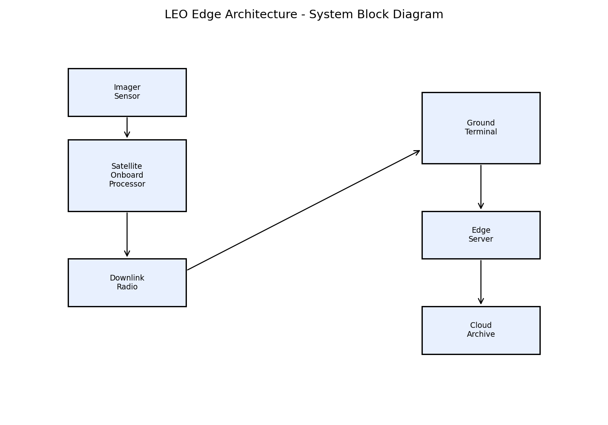
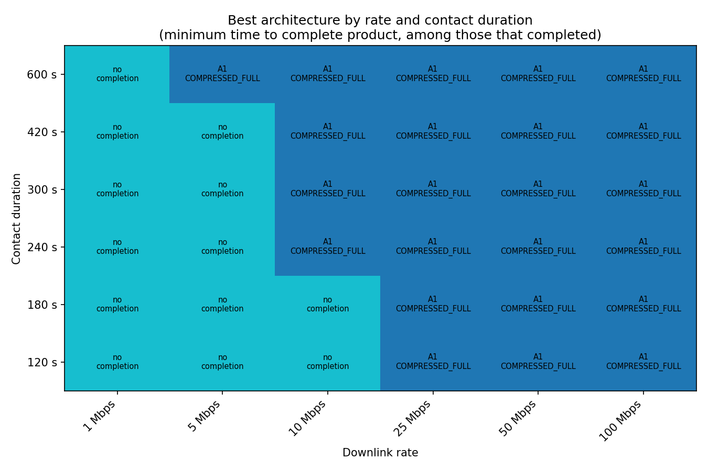

# LEO Edge Architecture

**Everything in this repository is notional and unofficial. It does not
represent an Army requirement, program, doctrine position, or acquisition
decision.**

A reproducible systems-architecture study: the Army increasingly consumes
imagery from commercial LEO providers while owning its own tactical edge
ground terminals. How should imagery functions (tasking, collection,
processing, prioritization, delivery) be allocated between the commercial
space segment and the Army-owned edge segment, and how does the preferred
allocation shift with mission need, terminal class, and contested
conditions?

`docs/OPERATIONAL_CONTEXT.md` grounds that question in three real, publicly
documented Army programs (Remote Ground Terminal, TITAN, Next Generation
Tactical Terminal) without claiming to model any of them.

## The allocation decision space

`docs/ALLOCATION_SPACE.md` is the central document: it defines the
decisions (processing allocation, tasking path, product prioritization,
policy adaptivity), places the seven architectures this repository
evaluates (A0-A6) as points within that space, and states plainly which
regions (split processing, terminal-class-dependent allocation,
change-detection support) still aren't covered. Mission-thread-aware
prioritization (A6) used to be on that list; it's now covered, with a
result.

`docs/STAKEHOLDERS.md`, `docs/REQUIREMENTS.md` (with a full traceability
matrix), and `docs/FUNCTIONAL_ARCHITECTURE.md` round out the systems
architecture; `docs/ARCHITECTURE_VIEWS.md` has the diagrams.

## The headline trade-study result

`docs/TRADE_STUDY.md` evaluates all seven architectures against four
notional mission threads, two terminal classes, and five contested-link
conditions, using real SGP4 contact windows and a Monte Carlo mission-
thread-success metric with bootstrap confidence intervals
(`experiments/e11_mission_thread_success.py`,
`scripts/trade_study.py`).

**Three of the seven architectures (raw downlink, compressed-full, and the
contact-aware adaptive policy) scored exactly 0% mission-thread success on
every thread and condition tested**, for a structural reason: none of them
ever produce anything but a single, full-scene-scale product, and three of
the four mission threads need an earlier tier. Among the architectures that
can succeed at all, **contact geometry dominates**: a single ground site
sees roughly 28 contact opportunities a week, hours apart on average, which
is longer than every mission thread's latency tolerance. The best-scoring
architecture, A6 (`ThreadAwarePriority`, which reorders delivery around
whichever tier the active mission thread actually needs instead of a fixed
order), still only reaches about a 2% mean mission-thread success rate
across all threads and conditions, and 5% in its single best cell.

`docs/ACQUISITION_IMPLICATIONS.md` draws out what that means: requiring
genuinely tiered products (not just onboard compression) from a commercial
provider is necessary but not sufficient, because **the acquisition lever
that actually moves the success number is contact frequency** (more
satellites reachable from a terminal, or more ground sites), not which
onboard processing architecture is used.

`docs/V1_VS_V2.md` documents a separate, earlier finding: the original
single-contact-window simulation had a real bug (uncapped byte counts) that
silently scored truncated deliveries as complete successes. Fixing it
changed which architecture "wins" a single contact window; see that
document for the full before/after. The original buggy results and the v1
paper draft built on top of them have been deleted, not kept; git history
has them if needed.

## System architecture



A commercial LEO satellite images an area of interest, optionally tiers
the product onboard, and downlinks during a contact window to an Army-
owned tactical edge terminal, either directly or through a rear-echelon
tasking cell. `docs/ARCHITECTURE_VIEWS.md` has the full view set (OV-2
resource flows, OV-5b activities per mission thread, OV-6c event trace,
and the 4+1 software views); `docs/OV1_SPEC.md` describes what a concept
graphic for the recommended allocation should show (no image is generated
by this repository; the old OV-1 concept graphic predates this rework's
research question and is retired).

## Single-contact-window regime map

Within one contact window, which architecture completes fastest still
depends heavily on rate and contact duration:



Grid cells marked "no completion" are exactly that: no architecture
delivered a complete product within that single window, honestly reported
instead of a fabricated completion time (`docs/DECISION_LOG.md` ADR-008).
This is single-window evidence, distinct from the multi-contact mission-
thread-success result above; `docs/MODEL_REFERENCE.md` explains how the
two relate.

## Novelty

`docs/NOVELTY.md` includes a real, verified literature scan (ten sources,
each cited with a title and URL, found this session) and states honestly
where this repository's contribution does and doesn't distinguish itself
from that literature.

## Quick start

```bash
uv sync
uv run pytest
make experiments
make figures
make trade_study
```

`make experiments` runs `e00` through `e11`, including the mission-thread
Monte Carlo; `make trade_study` regenerates the weighted scores in
`docs/TRADE_STUDY.md` from that output. `make reproduce` runs all of the
above. See `REPRODUCE_LOG.md` for a real run log.

## Repository map

| Path | What's there |
|---|---|
| `src/leo_edge/` | The architecture, orbit, imagery, and metrics model |
| `experiments/` | `e00` through `e11`, each answering one question about the model |
| `results/frozen/v2/` | Frozen results from the corrected model (`docs/V1_VS_V2.md` explains the "v2" name; there's no v1 directory anymore, see below) |
| `figures/` | Figures generated from `results/frozen/v2/`, see `figures/README.md` |
| `docs/` | Operational context, stakeholders, requirements, allocation space, trade study, acquisition implications, architecture views, novelty, assumptions, decisions, hand-calculation check |
| `app/dashboard.py` | A Streamlit dashboard for exploring the architectures interactively |

## License

Public source, unclassified, MIT licensed. See `LICENSE`.
