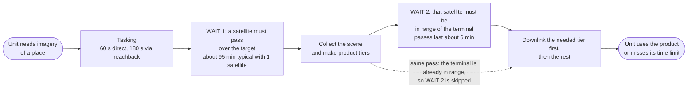
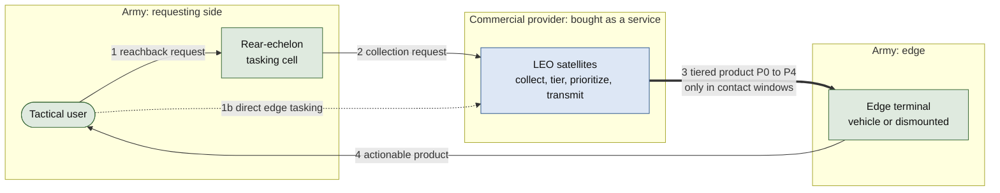
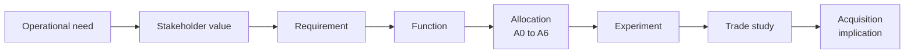

# LEO Edge Architecture

**Everything in this repository is notional and unofficial. It does not
represent an Army requirement, program, doctrine position, or acquisition
decision.**

A reproducible systems-architecture study: the Army increasingly consumes
imagery from commercial LEO providers while owning its own tactical edge
ground terminals. How should imagery functions (tasking, collection,
processing, prioritization, delivery) be allocated between the commercial
space segment and the Army-owned edge segment, and how does the preferred
allocation shift with mission need, terminal class, and contested
conditions?

`docs/OPERATIONAL_CONTEXT.md` grounds that question in three real, publicly
documented Army programs (Remote Ground Terminal, TITAN, Next Generation
Tactical Terminal) without claiming to model any of them.

## How it works operationally

A unit cannot get imagery on demand. A satellite sees a place only when it
passes over it, and it can send data to a terminal only while it is in range,
about 6 minutes at a time. So a request waits twice: once for a satellite to
pass over the target, once for that satellite to be in range of the terminal.
Time limits run from 2 minutes to 15 minutes; with one satellite the typical
first wait alone is about 95 minutes.



That mismatch drives every finding here. `docs/CONOPS.md` has the full
walkthrough, a worked example, and who owns what. The dashboard
(`app/dashboard.py`, run with `uv run streamlit run app/dashboard.py`) lets you
try it interactively.

## The allocation decision space

`docs/ALLOCATION_SPACE.md` is the central document: it defines the
decisions (processing allocation, tasking path, product prioritization,
policy adaptivity), places the seven architectures this repository
evaluates (A0-A6) as points within that space, and states plainly which
regions (split processing, terminal-class-dependent allocation,
change-detection support) still aren't covered. Mission-thread-aware
prioritization (A6) used to be on that list; it's now covered, with a
result.

`docs/STAKEHOLDERS.md`, `docs/REQUIREMENTS.md` (with a full traceability
matrix), and `docs/FUNCTIONAL_ARCHITECTURE.md` round out the systems
architecture; `docs/ARCHITECTURE_VIEWS.md` has the diagrams.

## The headline result: access moves success most; tiering is necessary; architecture starts to matter once access is high

`experiments/e12_access_sweep.py` sweeps real Walker-delta constellations
(every satellite propagated individually with SGP4) from 1 to 24
satellites and 1 to 4 Army ground terminals, with same-pass
collect-and-downlink allowed, and tests architecture differences only in
cells where the best architecture succeeds more than 30% of the time.

- **Access dominates in magnitude.** The best architecture's pooled
  mission-thread success rises from about 3% (1 satellite) to about 31%
  (24 satellites, 8 planes, 4 terminals). It never reached 50% and was
  still rising when the sweep stopped at 24 satellites, so the access level
  where success becomes "substantial" is not found here.
- **Tiering is necessary.** Raw downlink, compressed-full, and the
  contact-aware policy score 0% everywhere: none produces an early tier.
- **Architecture matters once access is high enough to test it.** In the
  one informative cell (24 satellites, 4 terminals), ThreadAwarePriority
  (31.2%) and Progressive (30.8%) tie, and both beat RoiFirst by about 7
  points and everything else by 24-31 points. The other 20 of 21 cells are
  uninformative (nothing works well enough to compare). This is thin
  evidence from one cell.

`docs/ACQUISITION_IMPLICATIONS.md` draws out what that means, including
which earlier claims were retracted and why. `docs/DECISION_LOG.md` records
each correction (ADR-008, ADR-019, ADR-020, ADR-024).

## System architecture



Green is Army-owned, blue is commercial. The thick arrow is the ownership
boundary, and it is the only place the Army depends on a provider's
implementation. The seven candidate architectures differ in what the blue box
does before that arrow.

The study connects one chain, and every document sits somewhere on it:



## Where to read next

| If you want | Read |
|---|---|
| The recommendations | `docs/ACQUISITION_IMPLICATIONS.md` |
| How the architectures compare | `docs/TRADE_STUDY.md` |
| What is being allocated and to whom | `docs/ALLOCATION_SPACE.md`, `docs/FUNCTIONAL_ARCHITECTURE.md` |
| The system from every angle | `docs/ARCHITECTURE_VIEWS.md`, `docs/INTERFACES.md`, `docs/ARCHITECTURE.md` |
| The mission threads and who cares | `docs/MISSION_THREADS.md`, `docs/STAKEHOLDERS.md` |
| How the numbers are computed | `docs/MODEL_REFERENCE.md`, `docs/EXPERIMENT_PLAN.md` |
| Why each modeling choice was made, and what was retracted | `docs/DECISION_LOG.md` |

## The access sweep


The first figure shows success rising with the number of satellites. The
second shows where architectures can be compared at all: grey cells are
uninformative because nothing worked well enough to test.

## Single-contact-window regime map

Within one contact window, which architecture completes fastest depends on
rate and contact duration:


Cells marked "no completion" mean no architecture delivered a complete
product in that one window (`docs/DECISION_LOG.md` ADR-008). This is
single-window evidence, separate from the multi-contact mission-thread
result above; `docs/MODEL_REFERENCE.md` explains how they relate.

## Novelty

`docs/NOVELTY.md` includes a real, verified literature scan (ten sources,
each cited with a title and URL, found this session) and states honestly
where this repository's contribution does and doesn't distinguish itself
from that literature.

## Quick start

```bash
uv sync
uv run pytest
make experiments      # e00 to e11, a few minutes
make figures
make trade_study
make access_sweep     # e12, real per-satellite SGP4, about an hour
```

`make reproduce` runs tests, experiments, figures, and the trade study, but
not the access sweep. `REPRODUCE_LOG.md` is a real run log.

## Repository map

| Path | What's there |
|---|---|
| `src/leo_edge/` | Architectures, product tiers, orbit and constellation model, mission threads, statistics |
| `experiments/` | `e00` through `e12`, each answering one question (`docs/EXPERIMENT_PLAN.md`) |
| `results/frozen/v4/` | Current frozen results; `v2/` and `v3/` are kept as history |
| `figures/` | Figures generated from `results/frozen/v4/` (`figures/README.md`) |
| `docs/` | Requirements, allocation space, architecture views, trade study, acquisition implications, decision log |
| `app/dashboard.py` | A Streamlit dashboard for exploring the architectures interactively |

## License

Public source, unclassified, MIT licensed. See `LICENSE`.
