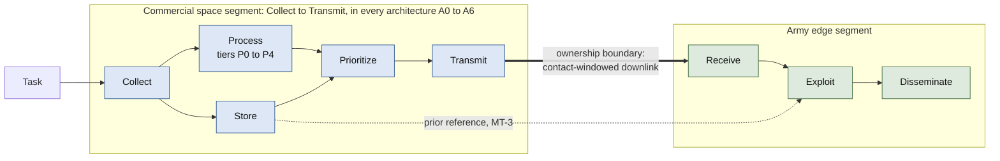

# Allocation Space

This is the central document of the rework. It defines the decisions that
make up "how should imagery functions be allocated between the commercial
LEO space segment and the Army-owned edge segment," places the seven
architectures this repository actually evaluates (A0-A6) as points within
that space, and states plainly which regions of the space are not covered
and why.

## The operational picture in one paragraph

A unit asks for imagery. A commercial satellite has to pass over the target,
collect it, and later send it to the Army terminal during a pass that lasts a
few minutes (`docs/CONOPS.md`). Because those windows are so short and far
apart, what the satellite sends first, and how it decides, decides whether the
unit gets something useful in time. The architectures below are seven
different answers to that question.

## The decision axes

An allocation is a choice along four axes. Two segments own the functions
from `docs/FUNCTIONAL_ARCHITECTURE.md`: the **commercial space segment**
(the satellite, owned and operated by the provider) and the **Army edge
segment** (the tactical terminal). A third, optional segment, the
**rear-echelon node**, participates only in the tasking axis.

1. **Processing allocation**: how much of the Process function (P0-P4
   tiering) happens onboard the satellite (commercial segment) versus at
   the edge terminal (Army segment) versus not at all (raw only). The
   satellite can only send what it has already produced or has capacity to
   transmit raw; the edge terminal can only re-derive further tiers from
   what it actually received, and only if its compute class allows it
   (`docs/MISSION_THREADS.md` terminal classes).
2. **Tasking path**: reachback through a rear-echelon tasking cell, or
   direct edge tasking of the commercial provider
   (`docs/MISSION_THREADS.md`).
3. **Product ordering and prioritization**: fixed priority order
   (metadata, thumbnail, quicklook, ROI, full, in that order regardless of
   mission thread) versus mission-thread-aware prioritization (e.g., MT-2
   prioritizes ROI over quicklook, since a coarse product doesn't serve a
   route-reconnaissance thread's fidelity floor).
4. **Policy adaptivity**: static (the same fixed choice every contact,
   regardless of conditions) versus contact-aware (the choice changes
   based on predicted contact margin, `docs/MISSION_THREADS.md`'s
   contested-condition parameters).

## Where the ownership boundary falls

Every architecture here puts Process and Prioritize on the commercial side.
That is the first thing to notice: the seven architectures differ in how
the commercial side processes and orders products, not in which segment
owns the work. Moving Process across the boundary (split processing) is
the largest region this repository does not cover (see "Uncovered regions").

## The seven architectures as points in this space

| Architecture | Processing allocation | Tasking path | Product ordering | Policy adaptivity |
|---|---|---|---|---|
| A0_GROUND_ONLY | None onboard; raw only | Modeled (reachback or direct, `docs/MISSION_THREADS.md`) | N/A, single product | Static |
| A1_COMPRESSED_FULL | Full onboard compression, one atomic product | Modeled | N/A, single product | Static |
| A2_QUICKLOOK_FIRST | Onboard quicklook, then full if capacity allows | Modeled | Fixed: quicklook always first | Static |
| A3_ROI_FIRST | Onboard ROI crop, then full if capacity allows | Modeled | Fixed: ROI always first | Static |
| A4_PROGRESSIVE | Onboard, all five tiers in fixed order as capacity allows | Modeled | Fixed: metadata, thumbnail, quicklook, ROI, full | Static |
| A5_CONTACT_AWARE | Onboard compression, chosen only if margin allows; raw fallback otherwise | Modeled | N/A, single product per choice | Adaptive (contact-margin rule) |
| A6_THREAD_AWARE_PRIORITY | Onboard, same five tiers as A4, reordered around the active thread's needed tier | Modeled | Adaptive: the thread's needed tier is prioritized right after metadata, `src/leo_edge/architectures.py`'s `ThreadAwarePriority` | Static per request (the priority tier is fixed at construction, not re-evaluated mid-delivery) |

A0-A5 all fix the product-ordering axis to a scene-agnostic priority order
(none of them reorder based on which mission thread is running). A6 closes
that specific gap; it's a direct answer to the "most direct next
experiment" this document originally flagged as missing (see
`docs/DECISION_LOG.md` for when A6 was added and what it changed).
Tasking-path latency is modeled for all seven via
`experiments/e11_mission_thread_success.py`'s tasking-delay parameter,
applied uniformly regardless of architecture; none of them internally
choose between reachback and direct tasking, that choice is external
(`docs/MISSION_THREADS.md`'s tasking-path table).

## What A6 changed, and what it didn't

`docs/TRADE_STUDY.md` has the full result. At the single-satellite baseline
(`results/frozen/v4/e11_significance_tests.csv`), A6 (ThreadAwarePriority)
had the most mission-thread successes (142 of 9,000 paired trials), ahead of
Progressive (129) and RoiFirst (109), and every one of those gaps is
statistically significant. At the one informative cell of the access sweep
(24 satellites, 8 planes, 4 terminals) A6 and Progressive are tied (31.2% vs.
30.8%) and both beat RoiFirst by about 7 points. A6 also has the largest
interface to specify (6 on the lock-in score, because it decides its
priority tier per request), which is why RoiFirst still wins the combined
trade-study ranking. Access, not architecture, still moves success the most
(`docs/ACQUISITION_IMPLICATIONS.md`).

## Uncovered regions

- **Split processing** (partial tiering onboard, remaining tiering at the
  edge terminal) is not modeled at all. Every architecture here either does
  all its processing onboard or none; there's no architecture where the
  satellite sends a partially-processed intermediate product and the edge
  terminal finishes deriving further tiers locally, which is exactly the
  kind of allocation a vehicle-mounted terminal's "meaningful edge compute"
  (`docs/MISSION_THREADS.md`) would make possible and a dismounted
  terminal's minimal compute would not.
- **Terminal-class-dependent allocation** is defined as a parameter
  (`docs/MISSION_THREADS.md`) but no architecture in `architectures.py`
  currently branches on terminal class; today's architectures behave
  identically regardless of which terminal receives their output. A
  terminal-aware version of A5's rule (fall back differently for a
  dismounted vs. vehicle-mounted terminal) is a natural adaptive-policy
  extension this repository doesn't yet have.
- **Change-detection-specific processing** (MT-3's need for a stored prior
  reference and a difference product) has no corresponding function
  allocation at all; `docs/FUNCTIONAL_ARCHITECTURE.md`'s Store-to-Exploit
  path for a prior reference is defined conceptually but not implemented in
  `src/leo_edge/`.

## Why these gaps are stated, not filled

Filling all of these would turn this into a much larger simulation project
than an undergraduate-scope study should attempt (`docs/RESEARCH_DESIGN.md`).
The trade study (`docs/TRADE_STUDY.md`) evaluates the seven architectures
that exist, honestly, against the mission threads that exist, and states
these gaps as exactly that: gaps, not findings the data can speak to. A
reader should not conclude from the trade study's results that split
processing, terminal-class-dependent allocation, or change-detection
support would perform worse than what's here; that comparison was never
run. Mission-thread-aware prioritization is the one item that moved from
this list to "covered, with a result" (A6, above); the rest remain open.
