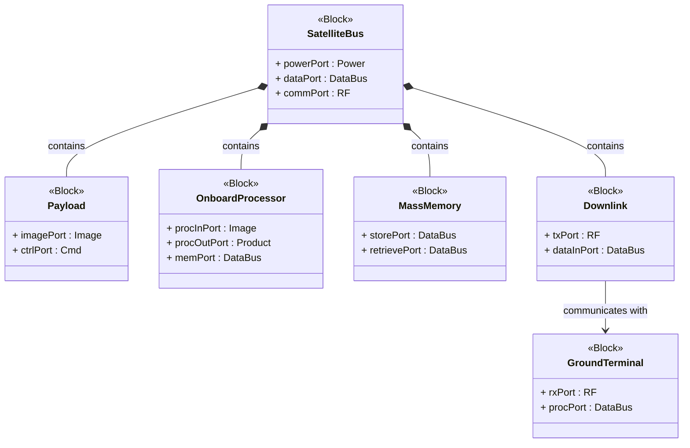
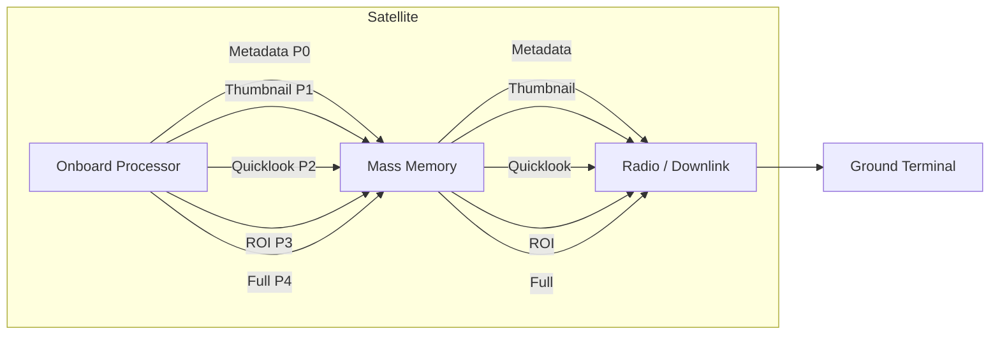
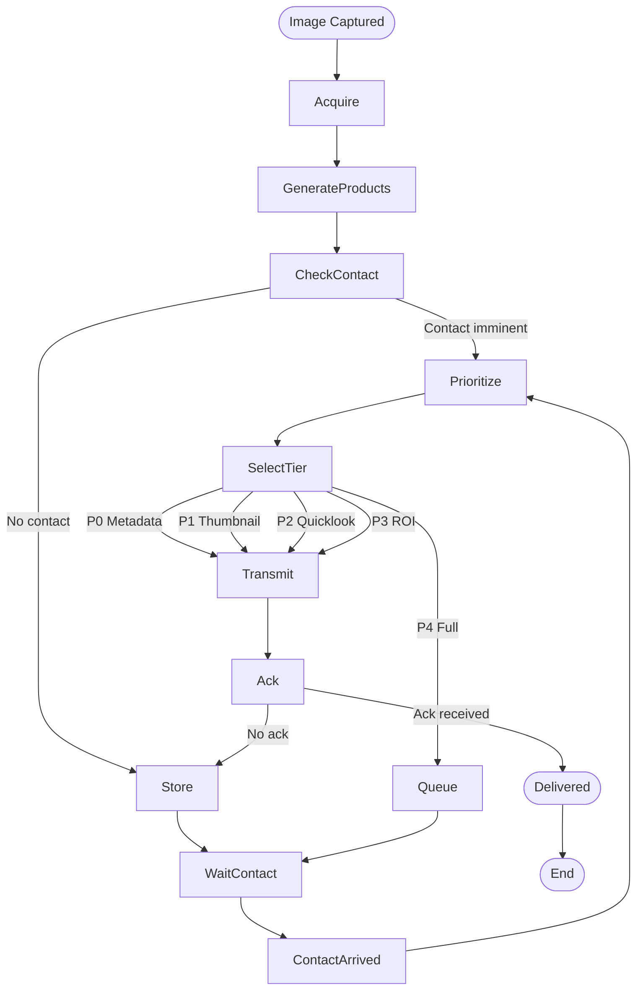
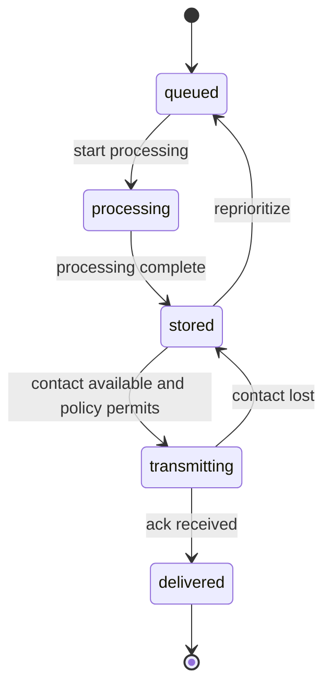

# ARCHITECTURE

System architecture for LEO edge processing placement and progressive direct-to-edge imagery delivery.

## Overview

The architecture models a COTS-heavy small satellite with onboard processing, mass memory, and a radio downlink communicating with a generic ground terminal. Processing placement decisions are governed by contact windows and product tier prioritization.

## Block Definition Diagram

Logical blocks and key ports.

## Internal Block Diagram

Data flows for product tiers between onboard elements.

## Activity Diagram

Progressive delivery pipeline with Contact-Aware policy decisions.

## State Machine

ProductQueue lifecycle.

