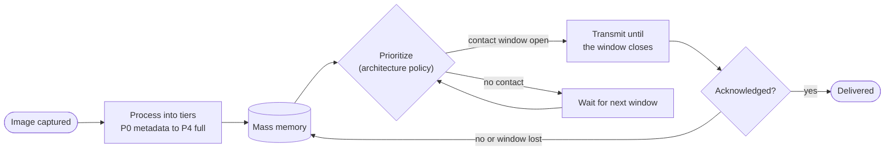
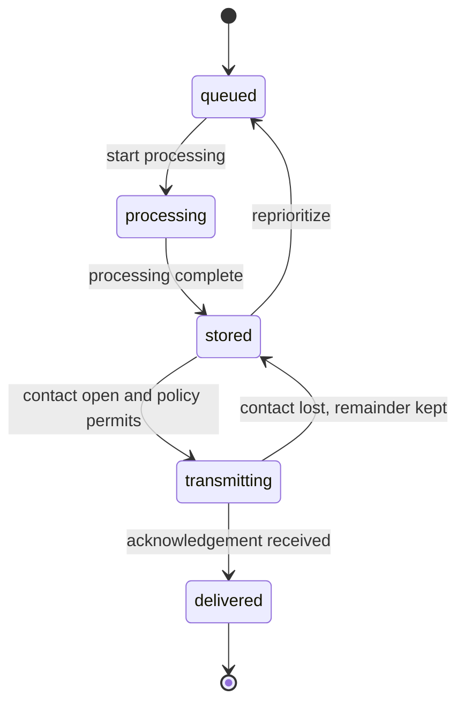

# Satellite-Side Architecture

This document zooms into the commercial satellite: what happens to an
image between capture and delivery. It is the inside of the "Commercial
provider" box in `docs/ARCHITECTURE_VIEWS.md`, which is where the
ownership boundary with the Army edge is drawn. Read that first if you want
the whole system; read this if you want to know what an architecture such
as Progressive or ContactAware actually does on the satellite.

## Product flow inside the satellite

An image is captured, reduced to one or more product tiers, stored, and sent
in priority order whenever a contact window is open. Nothing is delivered
until an acknowledgement comes back.

How to read it: the loop from "Transmit" back to "Mass memory" is the point
of the whole study. A window that closes mid-tier does not lose the bytes
already sent; the remainder carries into the next window
(`simulation.simulate_multi_contact`, `docs/MODEL_REFERENCE.md`).

What differs between architectures is only the "Process" and "Prioritize"
boxes:

| Architecture | What it does in those two boxes |
|---|---|
| A0 GroundOnly | No processing; sends the raw scene |
| A1 CompressedFull | Compresses once; sends one product |
| A2 QuicklookFirst | Makes a quicklook first, then the full scene |
| A3 RoiFirst | Crops a region of interest first, then the full scene |
| A4 Progressive | Sends P0, P1, P2, P3, P4 in fixed order |
| A5 ContactAware | Checks contact margin once; sends compressed or raw |
| A6 ThreadAwarePriority | Like A4, but the tier the active mission thread needs goes first |

## Product lifecycle

Each queued product moves through these states.

The invariants behind this diagram (bytes sent never exceed window capacity,
storage never goes negative, an unfinished product is censored rather than
scored as complete) are listed in `docs/V_AND_V.md`.
