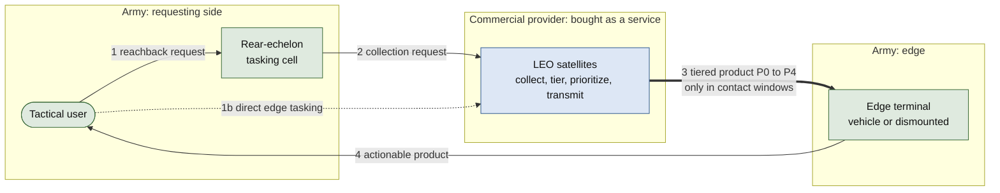
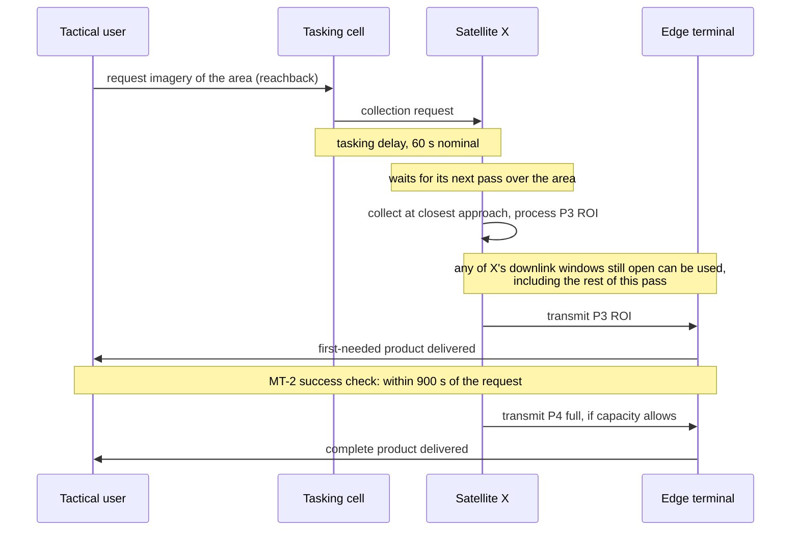
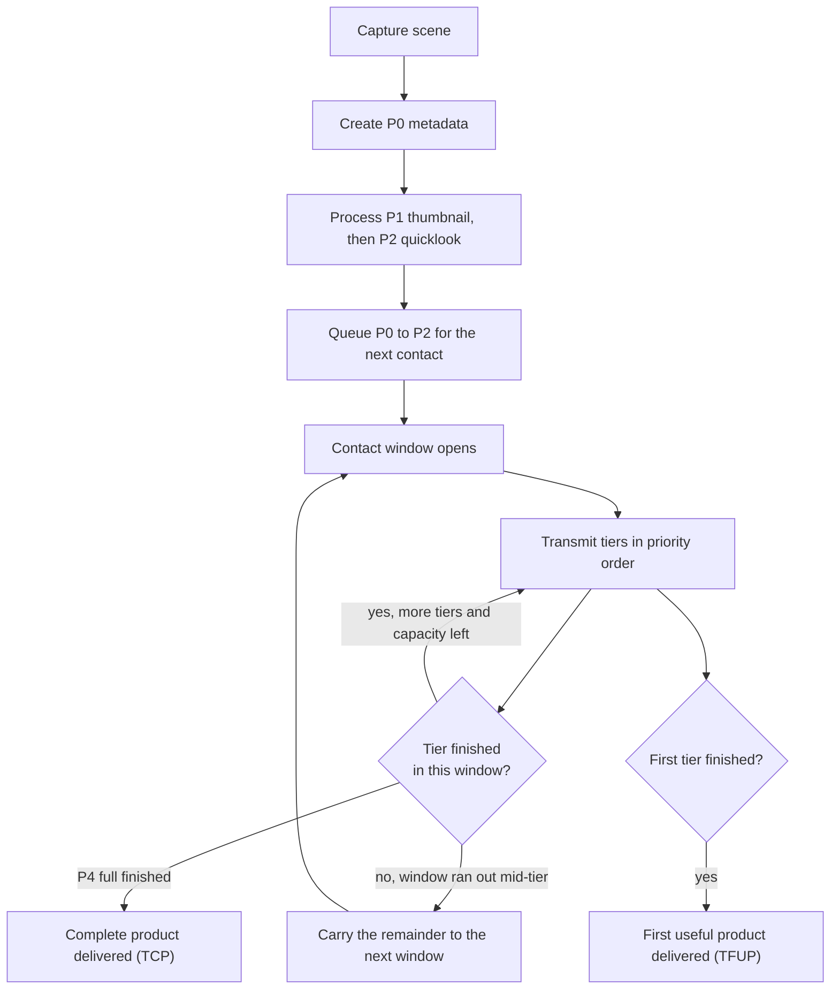
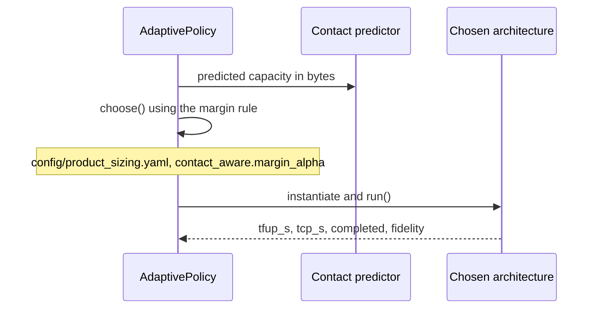
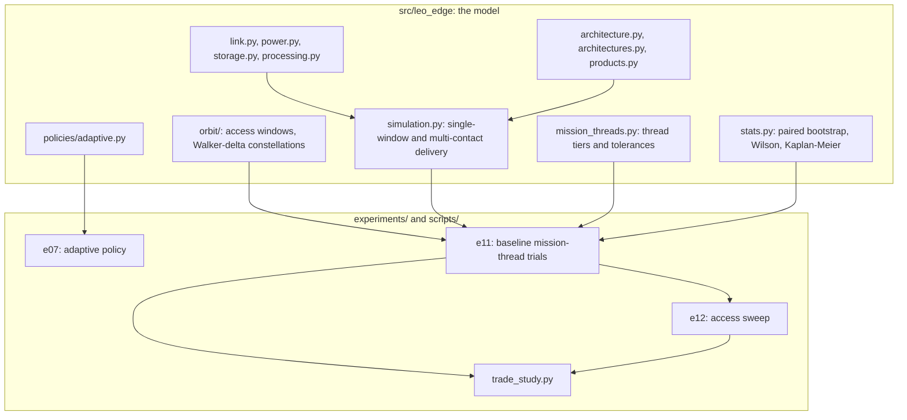
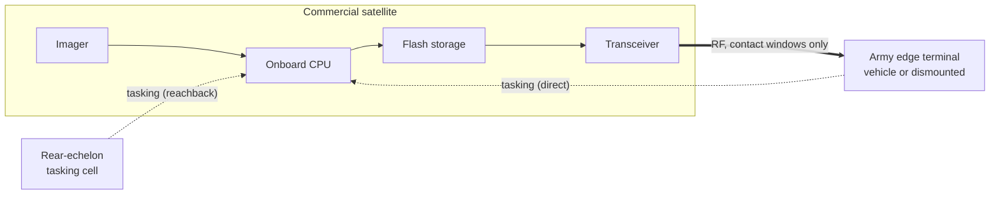

# Architecture Views

The system from several angles: who talks to whom, what happens in what
order, which function lives in which segment, how the code is organized, and
what physically connects. All views answer one question: how should imagery
functions be split between a commercial LEO provider and an Army-owned edge
terminal (`docs/DECISION_LOG.md` ADR-007). Everything here is notional.

Where to go next: `docs/FUNCTIONAL_ARCHITECTURE.md` (what each function
does), `docs/ALLOCATION_SPACE.md` (who owns each function, and the seven
candidate architectures), `docs/ARCHITECTURE.md` (inside the satellite),
`docs/INTERFACES.md` (what crosses the ownership boundary).

## System context

How to read it: green is Army-owned, blue is commercial. The thick arrow is
the ownership boundary and the only place the Army depends on a provider's
implementation. Everything the study varies (which tiers exist, in what
order they are sent, how a satellite decides) happens to the left of that
arrow; everything the terminal can do with what arrives happens to the right.

## Operational view

Actors: tactical user, rear-echelon tasking cell, commercial provider, Army
edge terminal (`docs/STAKEHOLDERS.md` says what each values).

### What each mission thread needs

Every thread walks the same function chain (`docs/FUNCTIONAL_ARCHITECTURE.md`)
and stops at a different point for "first actionable":

| Thread | First-needed product is ready when | Complete product |
|---|---|---|
| MT-1 cueing | P2 quicklook is processed, transmitted, received, exploited | Not required |
| MT-2 route recon | P3 ROI arrives and is exploited | P4 full scene arrives |
| MT-3 damage assessment | Change product from stored prior plus new collection | P4 full scene arrives |
| MT-4 persistent monitoring | P1 thumbnail arrives, repeated per pass | P4 when capacity allows |

### Event trace: MT-2 route reconnaissance, nominal case

**TFUP** (time to first useful product) is the time from the user's request
to the thread's first-needed tier arriving, including the tasking delay, the
wait for a collection pass, and the wait for a downlink window. **TCP** (time
to complete product) is the same for the complete product, and is `NaN` when
that product never arrives in the windows evaluated (`docs/DECISION_LOG.md`
ADR-008). `docs/MODEL_REFERENCE.md` has the exact accounting.

## Logical view: who owns which function

The function-to-segment allocation is drawn in `docs/ALLOCATION_SPACE.md`
(the ownership-boundary diagram) and tabulated in `docs/INTERFACES.md`. In
short, Task is shared with a rear-echelon cell, Collect through Transmit are
commercial, and Receive, Exploit, and Disseminate are Army.

The seven candidate architectures differ only in how the commercial side
processes and orders products. No architecture here moves any processing to
the Army edge; `docs/ALLOCATION_SPACE.md` lists that as a gap, not a finding.

Product tiers (`src/leo_edge/products.py`): P0 metadata, P1 thumbnail, P2
quicklook, P3 ROI, P4 full.

## Process view

### Progressive delivery (A4)

This mirrors `leo_edge.simulation.simulate_multi_contact`'s carry-forward
logic, not an idealized version of it.

### Adaptive policy (A5)

`AdaptivePolicy.choose()` returns a real architecture class, not a label
(`docs/DECISION_LOG.md` ADR-008).

## Development view

`docs/EXPERIMENT_PLAN.md` lists every experiment and what it answers.

## Physical view

The dotted lines are tasking commands going up to the satellite; the thick
line is imagery coming down to the terminal.

Constraints that shape every result:

- Contact is intermittent and windowed. This dominates the mission-thread
  results (`docs/TRADE_STUDY.md`).
- Terminal class bounds downlink rate and edge compute, independently of
  which architecture the satellite runs (`docs/MISSION_THREADS.md`).
- Onboard energy is limited: `processing_energy_j` against `tx_energy_j`
  (`config/product_sizing.yaml`).
- `storage_peak_bytes` is limited and `contact_utilization` stays in [0, 1]
  (`docs/DECISION_LOG.md` ADR-008).

The single-window analytical check (`docs/HAND_CALC_BREAK_EVEN.md`) is
`T_proc + D_p/R < D_r/R`, equivalently `T_proc < (D_r - D_p)/R`.

## Keeping these views current

The requirement-to-test matrix lives in `docs/REQUIREMENTS.md`. These views
are maintained by hand; a change to architecture IDs, product tiers, or
metrics means updating this file, `docs/DATA_DICTIONARY.md`, and
`docs/ASSUMPTIONS.md` together.
