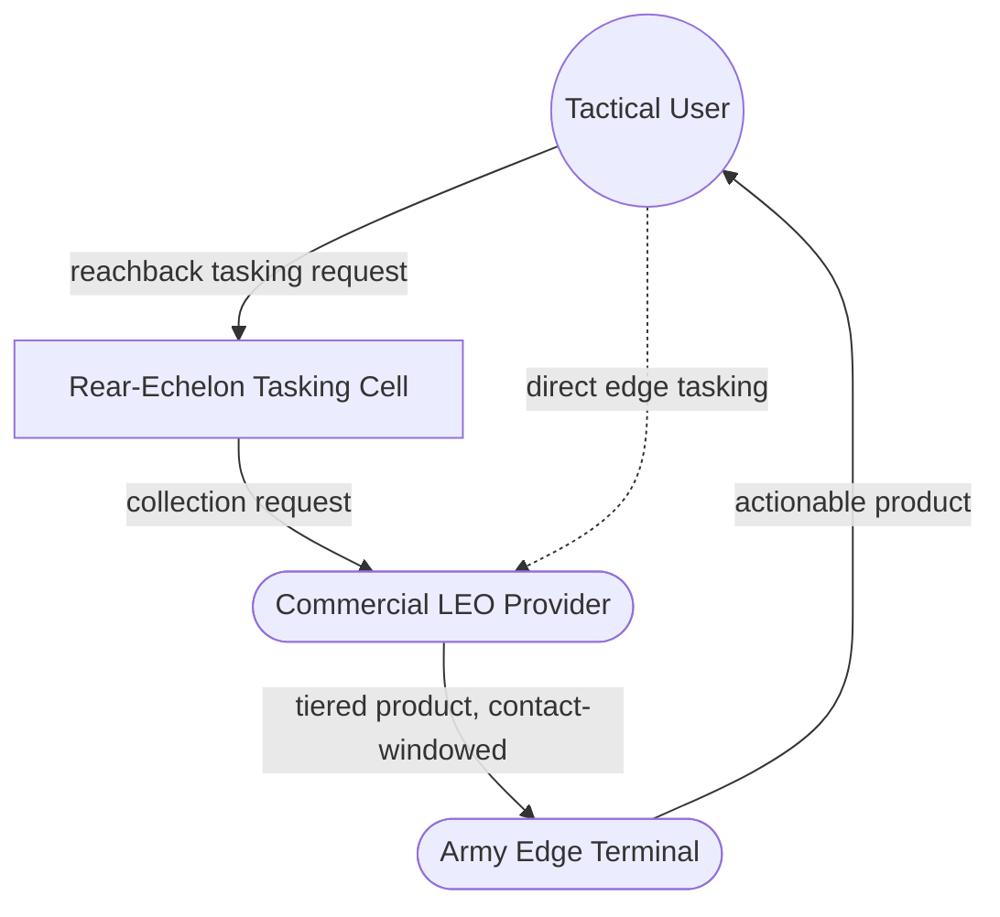
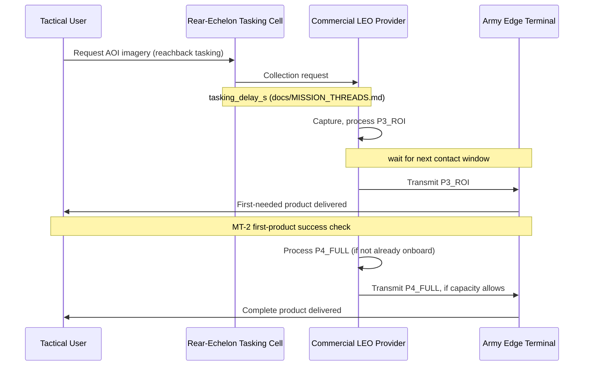
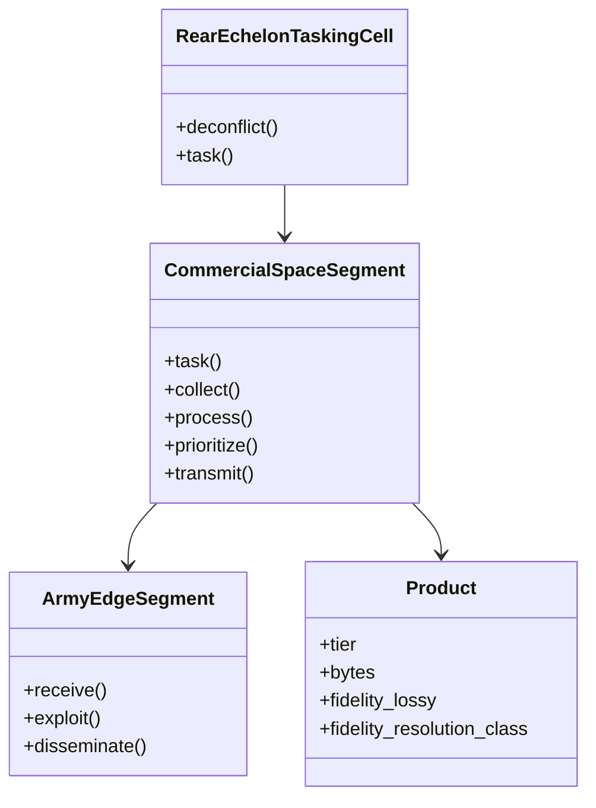
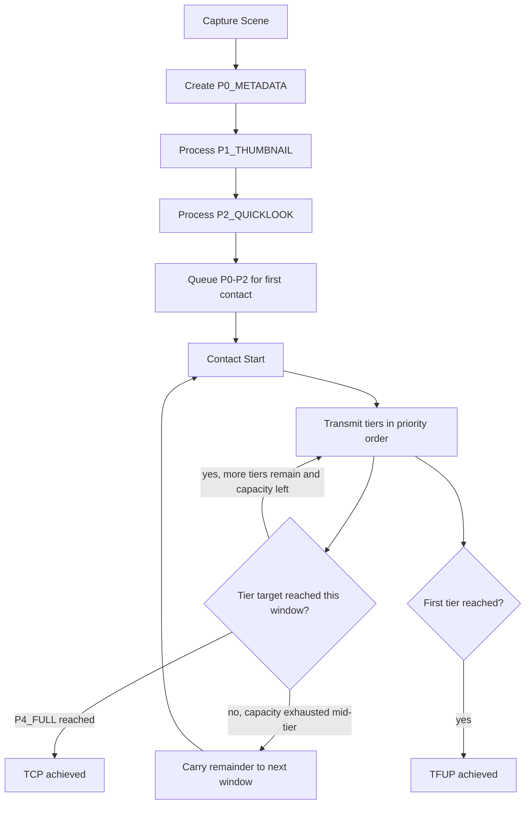
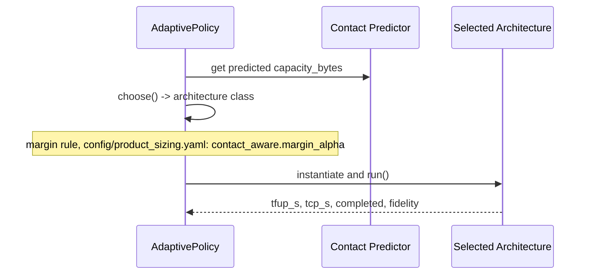
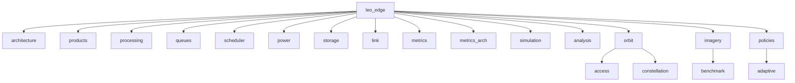
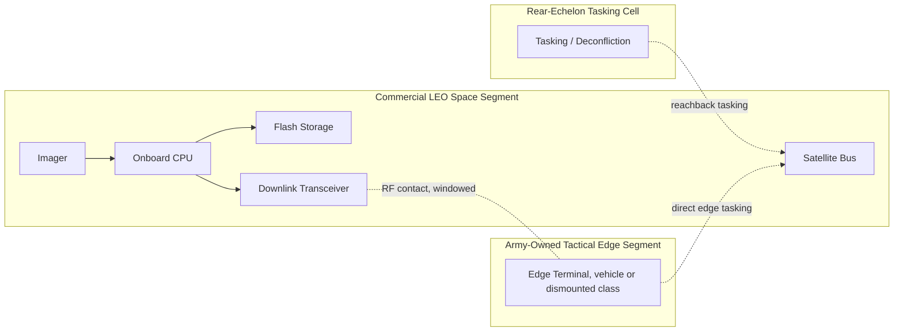

# Architecture Views

Software/systems views for the LEO Edge Architecture repository, tracing to
the current research question (`docs/DECISION_LOG.md` ADR-007): *how
should imagery functions be allocated between a commercial LEO space
segment acquired as a service and an Army-owned tactical edge segment, and
how does the preferred allocation shift with mission need, terminal class,
and contested conditions?* This replaces the v1 version of this document,
which traced to the retired onboard-vs-ground-processing question. The old
DoDAF-style operational-viewpoint document that also carried that framing
has been deleted from the working tree, not kept (`docs/DECISION_LOG.md`
ADR-011); this document is now the sole operational/architecture view.

These views cover both the DoDAF-style operational content this rework
introduced (OV-2 resource flows, OV-5b activities, OV-6c event trace,
folded into the Operational/Scenario view below rather than a separate
document) and the 4+1 software views already in this repository, since
both describe the same system from different angles and keeping them in
one document is easier to keep consistent than two.

## Operational / Scenario View (OV-2, OV-5b, OV-6c)

Actors: Tactical User, Rear-Echelon Tasking Cell, Commercial LEO Provider
(space segment), Army Edge Terminal. See `docs/STAKEHOLDERS.md` for what
each actor values.

### OV-2: Resource flow



The ownership boundary is the arrow from Provider to Terminal: everything
left of it is commercial-segment-owned, everything right of it is
Army-owned. `docs/ALLOCATION_SPACE.md` is about what crosses that boundary
and in what form.

### OV-5b: Activities per mission thread

Each mission thread (`docs/MISSION_THREADS.md`) walks the same function
sequence (`docs/FUNCTIONAL_ARCHITECTURE.md`: Task, Collect, Store, Process,
Prioritize, Transmit, Receive, Exploit, Disseminate) but stops at a
different point for "first actionable":

| Thread | First-needed function completes at | Complete-product function completes at |
|---|---|---|
| MT-1 (cueing) | Process (P2 quicklook) -> Transmit -> Receive -> Exploit | N/A, no complete product required |
| MT-2 (route recon) | Process (P3 ROI) -> Transmit -> Receive -> Exploit | Process (P4 full) -> Transmit -> Receive -> Exploit |
| MT-3 (BDA / change detection) | Store (prior) + Process (change product) -> Exploit | Process (P4 full) -> Transmit -> Receive -> Exploit |
| MT-4 (persistent monitoring) | Process (P1 thumbnail), repeated per contact | Process (P4 full), when capacity allows, per contact |

### OV-6c: Event trace, MT-2 (route reconnaissance) nominal case



**TFUP definition**: elapsed time from user request to the thread's
first-needed tier arriving at the terminal, including tasking delay and
wait-for-contact (`docs/MODEL_REFERENCE.md`'s latency accounting).

**TCP definition**: elapsed time from user request to the thread's
complete product arriving, same accounting. `NaN`/uncompleted when the
complete product never arrives within the windows evaluated
(`docs/DECISION_LOG.md` ADR-008).

## Logical View (SV-4-equivalent: function to system allocation)



Product tiers: P0_METADATA, P1_THUMBNAIL, P2_QUICKLOOK, P3_ROI, P4_FULL
(`src/leo_edge/products.py`).

Architecture alternatives allocate the Process/Prioritize functions within
the commercial space segment (none of A0-A6 currently allocate any
processing to the Army edge segment; `docs/ALLOCATION_SPACE.md`'s
"uncovered regions" section states this as a gap, not a finding):

- A0_GROUND_ONLY: no onboard processing, raw only
- A1_COMPRESSED_FULL: onboard compress, one atomic product
- A2_QUICKLOOK_FIRST: onboard quicklook, then full if capacity allows
- A3_ROI_FIRST: onboard ROI extract, then full if capacity allows
- A4_PROGRESSIVE: P0->P1->P2->P3->P4, as capacity allows
- A5_CONTACT_AWARE: margin-gated compressed-or-raw choice, evaluated once
  per delivery (`src/leo_edge/architectures.py`'s `ContactAware`)
- A6_THREAD_AWARE_PRIORITY: same five tiers as Progressive, reordered
  around the active mission thread's needed tier
  (`src/leo_edge/architectures.py`'s `ThreadAwarePriority`)

## Process View

### Activity Diagram: Progressive Delivery (A4)



This mirrors `leo_edge.simulation.simulate_multi_contact`'s actual
carry-forward logic (`docs/MODEL_REFERENCE.md`), not an idealized version
of it.

### Sequence: Adaptive (A5) Policy Selection



`src/leo_edge/policies/adaptive.py`'s `AdaptivePolicy.choose()` returns a
real architecture class (`docs/DECISION_LOG.md` ADR-008), not a label with
no corresponding implementation.

## Development View

Software module structure in `src/leo_edge/`.



Mapping to the views above:
- `architecture.py`, `architectures.py` -> Logical view
- `policies/adaptive.py`, `simulation.py`'s `simulate_multi_contact` ->
  Process view, OV-6c event trace
- `orbit/*`, `link.py`, `power.py`, `storage.py` -> Physical view
  constraints
- `metrics.py`, `products.py`'s fidelity fields -> OV-5b/OV-6c success
  criteria (mission-thread success, `docs/MISSION_THREADS.md`)
- `experiments/e11_mission_thread_success.py`, `scripts/trade_study.py` ->
  evidence behind `docs/TRADE_STUDY.md`

## Physical View (SV-1-equivalent: system interfaces)



Constraints:
- Intermittent, windowed LEO contact (the dominant term in
  `docs/TRADE_STUDY.md`'s mission-thread-success results)
- Terminal class (`docs/MISSION_THREADS.md`) bounds downlink rate and edge
  compute, independently of which architecture the space segment runs
- Limited onboard energy budget: `processing_energy_j` vs `tx_energy_j`
  tradeoff (`config/product_sizing.yaml`)
- `storage_peak_bytes` limited; `contact_utilization` bounded to [0, 1]
  (`docs/DECISION_LOG.md` ADR-008)

Break-even relation used for the single-window analytical check
(`docs/HAND_CALC_BREAK_EVEN.md`, unaffected by this rework):
```
T_proc + D_p/R < D_r/R
T_proc < (D_r - D_p)/R
```

## Traceability

The requirement-to-test traceability matrix moved to `docs/REQUIREMENTS.md`
(it's the primary artifact requirements traceability belongs in, not
duplicated here). This document's job is describing the views, not
re-stating the matrix.

These views are maintained by hand alongside `src/leo_edge/`. Changes to
architecture IDs, product tiers, or metrics require updating this file,
`docs/DATA_DICTIONARY.md`, and `docs/ASSUMPTIONS.md` together.
