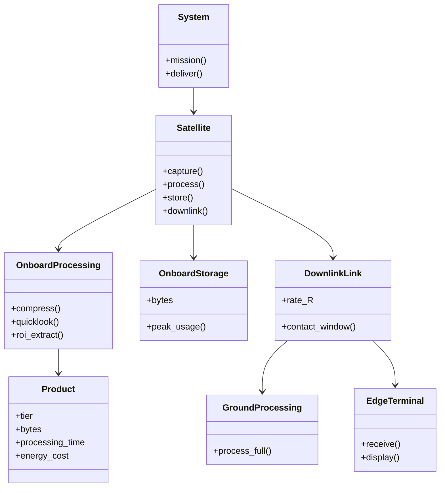
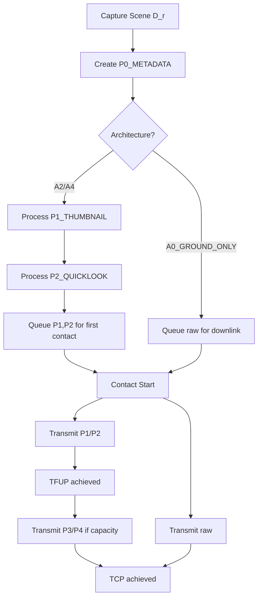
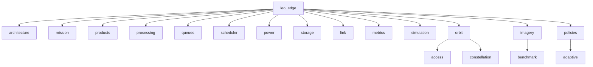
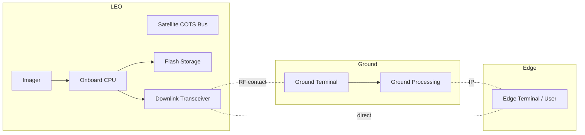

# Architecture Views - 4+1

This document captures the 4+1 architectural views for the LEO Edge Architecture research repository. Views trace to the research question: *Under intermittent LEO contact and spacecraft SWaP constraints, when should geospatial imagery be processed onboard a COTS-heavy small satellite rather than transmitted for processing at a local ground terminal?*

## Operational / Scenario View

Operational context and primary use case for direct-to-edge imagery delivery with Time to First Useful Product [TFUP].

Actors: Mission Planner, LEO Satellite, Ground Terminal, Edge User.

### Use Case Overview

```mermaid
graph TD
    MissionPlanner((Mission Planner))
    Satellite([LEO Satellite])
    GroundTerminal([Ground Terminal])
    EdgeUser((Edge User))

    MissionPlanner -->|requests collection| Satellite
    Satellite -->|captures scene| Satellite
    Satellite -->|downlinks products| GroundTerminal
    GroundTerminal -->|relays to edge| EdgeUser
    Satellite -.direct contact.| EdgeUser

    UC1((Direct-to-Edge Imagery Delivery))
    MissionPlanner --> UC1
    Satellite --> UC1
    GroundTerminal --> UC1
    EdgeUser --> UC1
```

### Direct-to-Edge TFUP Sequence

```mermaid
sequenceDiagram
    participant MP as Mission Planner
    participant SAT as Satellite
    participant STO as Onboard Storage
    participant PROC as Onboard Processing
    participant LINK as Downlink
    participant EDGE as Edge Terminal

    MP->>SAT: Collect request + product tier
    SAT->>SAT: Capture raw scene D_r
    SAT->>STO: Store raw
    alt Architecture A0_GROUND_ONLY
        SAT-->>LINK: Wait for contact
        LINK->>EDGE: Transmit raw
    else Architecture A2_QUICKLOOK_FIRST / A4_PROGRESSIVE
        SAT->>PROC: Process to P2_QUICKLOOK / P1_THUMBNAIL
        PROC->>LINK: Queue small product
        LINK->>EDGE: Transmit quicklook
        Note over SAT,EDGE: TFUP = T_capture + T_proc + T_wait_contact + T_tx_small
        LINK-->>EDGE: Later transmit P4_FULL
    end
    EDGE->>MP: TFUP achieved, completeness reported
```

**TFUP definition:** `tfup_s` = time from capture to first useful product [P1_THUMBNAIL / P2_QUICKLOOK] received at edge.

**TCP definition:** `tcp_s` = time to complete product [P4_FULL] received.

Operational requirement mapping:
- REQ-OP-01: System shall deliver P2_QUICKLOOK to edge within 300s of contact start under nominal contact
- REQ-OP-02: System shall support progressive delivery P0 → P1 → P2 → P3 → P4
- REQ-OP-03: System shall report product completeness and energy cost per delivery

## Logical View

Logical decomposition of system blocks and product tiers.

### Block Definition



Product tiers:
- P0_METADATA
- P1_THUMBNAIL
- P2_QUICKLOOK
- P3_ROI
- P4_FULL

Architecture alternatives allocate processing:
- A0_GROUND_ONLY: no onboard processing
- A1_COMPRESSED_FULL: onboard compress → P4
- A2_QUICKLOOK_FIRST: onboard quicklook → P2 first
- A3_ROI_FIRST: onboard ROI extract → P3 first
- A4_PROGRESSIVE: P1→P2→P3→P4 pipeline
- A5_CONTACT_AWARE: schedule based on T_lead and contact prediction

## Process View

Behavior of image flow through capture, queue, processing, and downlink.

### Activity Diagram - Progressive Delivery



### Sequence - Contact Aware Scheduling

```mermaid
sequenceDiagram
    participant Scheduler
    participant Queue
    participant Power
    participant Link
    participant Processor

    Scheduler->>Queue: get pending products
    Scheduler->>Link: predict T_lead
    Scheduler->>Power: check budget
    Scheduler->>Processor: schedule T_proc <= T_lead
    Processor-->>Scheduler: energy_j
    Scheduler->>Queue: prioritize by tfup_s
    Link->>Scheduler: contact start
    Scheduler->>Queue: release for tx
```

## Development View

Software module structure in `src/leo_edge/`.



Mapping to 4+1:
- `architecture.py`, `architectures.py` → Logical view
- `scheduler.py`, `queues.py`, `policies/adaptive.py` → Process view
- `orbit/*`, `link.py`, `power.py`, `storage.py` → Physical view constraints
- `metrics.py` → Operational metrics tfup_s, tcp_s, contact_utilization, processing_energy_j, tx_energy_j, storage_peak_bytes, deadline_met, product_completeness

## Physical View

Deployment of hardware and communication links with SWaP constraints.



Constraints:
- Intermittent LEO contact windows
- Limited onboard energy budget → processing_energy_j vs tx_energy_j tradeoff
- Storage_peak_bytes limited
- Downlink rate R varies per contact

Break-even relation used for validation:
```
T_proc + D_p/R < D_r/R
T_proc < (D_r - D_p)/R
Effective T_proc,exposed = max(0, T_proc - T_lead)
```

## Traceability Summary

| Req ID | Statement | Allocated To | Verified By |
|---|---|---|---|
| REQ-OP-01 | System shall deliver P2_QUICKLOOK to edge within 300s of contact start | Satellite.OnboardProcessing, DownlinkLink | tfup_s metric |
| REQ-OP-02 | System shall support progressive product tiers P0-P4 | Products, Policies | product_completeness |
| REQ-NF-01 | Processing energy shall not exceed 50 Wh per scene | OnboardProcessing, Power | processing_energy_j |
| REQ-NF-02 | Storage peak shall stay below 64 GB | OnboardStorage | storage_peak_bytes |
| REQ-NF-03 | Contact utilization >= 85% for A5_CONTACT_AWARE | Scheduler, Link | contact_utilization |

Views are maintained in `artifacts/model.md` as the model evolves. Changes to architecture IDs, product tiers, or metrics require update here and in `docs/engineering/ASSUMPTIONS.md`.
