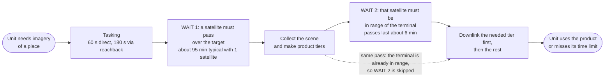

# Concept of Operations

The full operational picture, with actors, mission threads, and the OV-2/
OV-5b/OV-6c views, lives in `docs/OPERATIONAL_CONTEXT.md`,
`docs/MISSION_THREADS.md`, and `docs/ARCHITECTURE_VIEWS.md`. This page is
the short version. Everything here is notional and unofficial.

## The idea in one paragraph

A tactical user requests imagery of an area of interest, either through a
rear-echelon tasking cell or directly. A commercial LEO provider's
satellite captures the scene, generates one or more product tiers, and
downlinks to the Army-owned tactical edge terminal during a contact
window. The edge terminal receives and exploits whatever arrived. The
architectural question this project studies is which functions (tasking,
collection, processing, prioritization, delivery) should sit in the
commercial space segment versus the Army edge segment, and how the right
split changes with mission need, terminal class, and contested conditions.
`docs/ALLOCATION_SPACE.md` is the full answer to "what to do."

## What a unit actually experiences

A tactical unit does not get imagery on demand. A satellite orbits at roughly
550 km (the model's altitude) and sees any one place only when it passes over it. So a request
moves through two waits and a few seconds of work:

The numbers come from the model's own data, not from a real system:

- **Tasking** takes 60 s when the terminal tasks the provider directly and 180 s
  when the request goes through a rear-echelon cell (`docs/MISSION_THREADS.md`).
- **Wait 1** is the time until a satellite passes over the target. With one
  satellite the typical gap between chances is about 95 minutes, and the
  worst gap in a simulated week is about 11.6 hours
  (`results/frozen/v4/e12_feasibility_floors.csv`).
- **Wait 2** is the time until that same satellite is in range of the
  terminal. A pass lasts about 6 minutes (median 360 s,
  `results/frozen/v4/e01_access_windows.csv`), which is the only time bytes can
  flow. If the terminal is already in range when the satellite collects, the
  image can go down on that pass and Wait 2 disappears.
- **The time limits** are short: 2 minutes for a cue, 15 minutes for route
  reconnaissance (`docs/MISSION_THREADS.md`).

That gap between "minutes" and "hours" is why the study finds that
**how much satellite access the unit has matters more than which processing
architecture the provider runs**, and why a design that sends a small
early product first (a quicklook or a region-of-interest crop) is the
only kind that can ever meet a tight limit. A design that waits to send one
big product cannot.

### Worked example: route reconnaissance (MT-2)

1. A platoon leader needs a full-resolution look at a road segment before
   moving. Limit: 15 minutes.
2. The terminal tasks the provider directly (60 s).
3. The next satellite passes the target. With one satellite the typical wait
   is about 95 minutes; with 24 satellites in 8 planes the median gap is about
   21 minutes (`e12_feasibility_floors.csv`), still longer than the limit, which
   is why success stays modest even there.
4. In the A3 design the satellite crops the road segment (a P3
   region-of-interest product, 100 MB of a 1 GB scene) and holds the full scene for later.
5. When the satellite is in range of the terminal, it sends the crop first.
   At 50 Mbps a 100 MB crop takes about 16 s; at 5 Mbps (a dismounted
   terminal) it takes about 160 s.
6. The unit exploits the crop. If the request-to-crop time is 15 minutes or
   less, the thread succeeded.

## Who owns what

| Piece | Owner | What the Army controls |
|---|---|---|
| Satellites, sensors, onboard processing, prioritization | Commercial provider | Only what it writes into the service contract |
| The link between them | Shared physics | Nothing: it exists only during contact windows |
| Terminal, operators, exploitation, dissemination | Army | Everything |
| Tasking cell | Army | Everything |

The ownership boundary is the downlink. `docs/INTERFACES.md` lists what
crosses it, and `docs/ACQUISITION_IMPLICATIONS.md` says what the Army should
therefore specify in a contract.

## Product tiers

A satellite can generate five tiers of product, from smallest and fastest
to largest and slowest:

| Tier | What it is | Purpose |
|---|---|---|
| P0 Metadata | Timestamp, footprint, quality flags | Immediate awareness that a collection happened |
| P1 Thumbnail | Very small, low-resolution image | Fast confirmation the collection worked |
| P2 Quicklook | Reduced-resolution but interpretable image | Early situational understanding |
| P3 ROI | Full-resolution crop over a predeclared area of interest | Priority delivery of the part that matters most |
| P4 Full | Complete high-resolution image | Full analysis and archival |

## Scope

This is a research and simulation project, not an operational system. It
uses public/synthetic imagery and generic ground-terminal locations, and
it does not model target recognition, tracking, weapon cueing, or
classified workflows. See `AGENTS.md`'s non-negotiable scope boundaries
for the full list.
