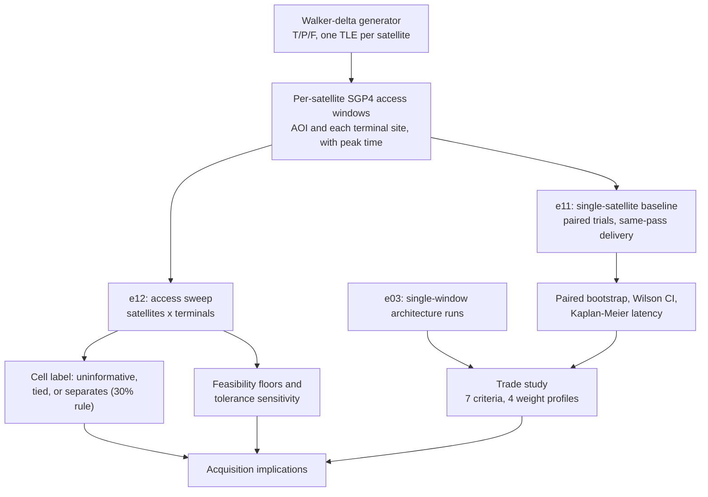

# Experiment Plan

Every experiment lives in `experiments/` and writes its output CSV to `results/raw/`, which gets copied into `results/frozen/v4/` once a result set is frozen. Run any of them with `PYTHONPATH=src python experiments/<name>.py`, or run all of them with `make experiments`.

| Script | Question it answers | Output |
|---|---|---|
| `e00_sanity.py` | Do the break-even formulas behave the way basic algebra says they should? | Printed sanity checks, no CSV |
| `e01_orbit_contacts.py` | What do real LEO contact windows look like for a representative orbit and ground station over a week? | `e01_access_windows.csv` |
| `e02_image_benchmark.py` | How much do compression, quicklook, and ROI extraction actually cost in size and runtime, on a synthetic test image? | `e02_compression.csv`, `e02_quicklook.csv`, `e02_roi.csv` |
| `e02_image_benchmark_tiles.py` | Does the same benchmark hold up on a larger set of real (or realistic synthetic) image tiles? | Benchmark results over `data/imagery/tiles/` |
| `e03_static_architectures.py` | Which architecture gives the lowest time-to-first-product and time-to-complete-product across a range of downlink rates? | `e03_results.csv` |
| `e04_contact_sweep.py` | How does the best architecture change as contact duration changes? | `e04_contact_sweep.csv` |
| `e05_power_sweep.py` | At what processor power does onboard processing stop being worth its energy cost? | `e05_power_sweep.csv` |
| `e06_queue_stress.py` | What happens to the backlog when scenes arrive faster than contacts can drain them? | `e06_queue_stress.csv` |
| `e07_adaptive_policy.py` | Does a simple rule-based adaptive policy track the best static architecture as contact capacity changes? | `e07_adaptive_policy.csv` |
| `e08_uncertainty.py` | How sensitive are the results to uncertainty in predicted contact capacity? | `e08_uncertainty.csv` |
| `e09_constellation_handoff.py` | How does a real 3-satellite Walker-delta constellation change contact availability compared with one satellite? | `e09_constellation.csv` |
| `e10_storage_wear.py` | Does repeated store/free cycling wear out flash storage over a realistic mission timeline? | `e10_storage_wear.csv` |
| `e11_mission_thread_success.py` | Which architecture, terminal class, and contested condition actually get a mission thread's needed product to the user in time, using real contact windows and a randomized request time? | `e11_mission_thread_success.csv`, `e11_mission_thread_trials.csv` |
| `e12_access_sweep.py` | As satellites (1 to 24, real Walker-delta) and ground terminals (1 to 4) increase, when does mission-thread success become substantial, and do architectures separate there? About an hour to run; not part of `make experiments` (use `make access_sweep`). | `e12_access_sweep.csv`, `e12_cell_status.csv`, `e12_significance_by_cell.csv`, `e12_feasibility_floors.csv`, `e12_km_summary.csv`, `e12_tolerance_sensitivity.csv`, `e12_cost_tradeoff.csv` |

## How the pieces feed each other

## Research design principle behind the sweeps

The point of e03 through e08 is not to crown one architecture "best." It's to find the conditions, in downlink rate, contact duration, processor power, and contact-capacity uncertainty, under which each architecture wins within a single contact window. `figures/fig04.png` (the regime map) is the direct answer to that question for the rate/duration axes. `e11` is a different, higher-level question: given a real week-long contact schedule and a mission thread's latency tolerance, does delivery actually succeed at all. `docs/TRADE_STUDY.md` and `scripts/trade_study.py` turn `e11`'s output (plus `e03`'s) into the weighted multi-criteria comparison that's an input to `docs/ACQUISITION_IMPLICATIONS.md`, whose headline comes from `e12`.

## What each experiment checks against the analytical model

`e00_sanity.py` and `docs/HAND_CALC_BREAK_EVEN.md` both check the simulation's timing model against the closed-form break-even relation `T_proc < (D_r - D_p) / R`. `e05_power_sweep.py` extends that check across a range of processor power values.
