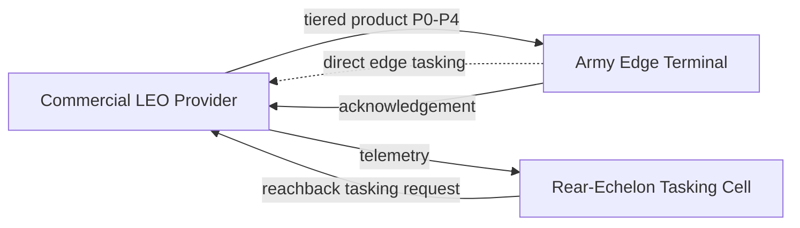

# Interfaces

SV-1-equivalent interface reference (`docs/ARCHITECTURE_VIEWS.md`'s
Physical View is the diagram; this is the detail table). Everything here
crosses the commercial-space-segment / Army-edge-segment ownership
boundary (`docs/ALLOCATION_SPACE.md`), which is exactly why
`docs/ACQUISITION_IMPLICATIONS.md` recommends standardizing this
interface, not any one provider's onboard implementation.

## Data formats

* Raw imagery: GeoTIFF, 16 bit, 3 bands
* Metadata (P0): JSON with timestamp, lat/lon, altitude, quality flags
* Thumbnail (P1) / Quicklook (P2): JPEG
* ROI (P3): GeoTIFF subset, full resolution, cropped
* Full (P4): GeoTIFF (GroundOnly) or compressed JPEG (CompressedFull and other onboard-processed architectures); see `docs/ASSUMPTIONS.md` ASM-PROC-002 for the compression ratio assumption

## Units

* Time: seconds
* Data: bytes
* Energy: joules
* Rate: bits per second

## Rates and throughput (design ranges used across `experiments/` and `docs/MISSION_THREADS.md`)

* Downlink: 1-100 Mbps (nominal single-window sweeps in `e03_static_architectures.py`); terminal-class-specific ranges are 10-100 Mbps (vehicle-mounted) and 1-10 Mbps (dismounted/manpack), `docs/MISSION_THREADS.md`
* Onboard processor throughput: not directly modeled as a byte rate; processing is a fixed nominal duration (`processing_time_s`, `config/product_sizing.yaml`), scaled by tier in `docs/MODEL_REFERENCE.md`

## Latency tolerances

There is no single blanket TFUP/TCP target. Each mission thread has its
own latency tolerance (`docs/MISSION_THREADS.md`): 120 s (MT-1), 900 s
(MT-2 first product), 300 s (MT-4 per pass). `docs/TRADE_STUDY.md` is the
evidence for whether any architecture meets these under real contact
geometry; as of that document, none does reliably.

## Energy budgets

* Processing power: 15 W (`config/product_sizing.yaml: power.processing_power_w`)
* Radio transmit power: 25 W (`config/product_sizing.yaml: power.radio_power_w`)
* Both are ASSUMED, not measured; see `docs/ASSUMPTIONS.md` ASM-LINK-002, ASM-PROC-001.

## Function-to-segment allocation

| Function | Segment | Notes |
|---|---|---|
| Task | Rear-echelon cell or Army edge terminal (both paths modeled) | `docs/MISSION_THREADS.md` tasking-path table |
| Collect | Commercial space segment | Not owned or influenced by the Army in this model beyond the tasking request |
| Process (tiering) | Commercial space segment, in every architecture this repository evaluates today | `docs/ALLOCATION_SPACE.md`'s uncovered-regions section: no architecture here allocates any processing to the Army edge segment |
| Prioritize | Commercial space segment | Fixed priority order in A0-A5; A6 reorders around the active mission thread's needed tier (`docs/ALLOCATION_SPACE.md`) |
| Transmit | Commercial space segment (satellite radio) | Contact-windowed, not continuous |
| Receive, Exploit, Disseminate | Army edge segment | Terminal-class-dependent capability, `docs/MISSION_THREADS.md` |

## N2 Diagram

## Interface Standards

All interfaces follow the documented units and formats above. Changes
require a `docs/DECISION_LOG.md` ADR, and must be reflected here,
`docs/DATA_DICTIONARY.md`, and `docs/ASSUMPTIONS.md` together
(`docs/ARCHITECTURE_VIEWS.md`'s closing note).
