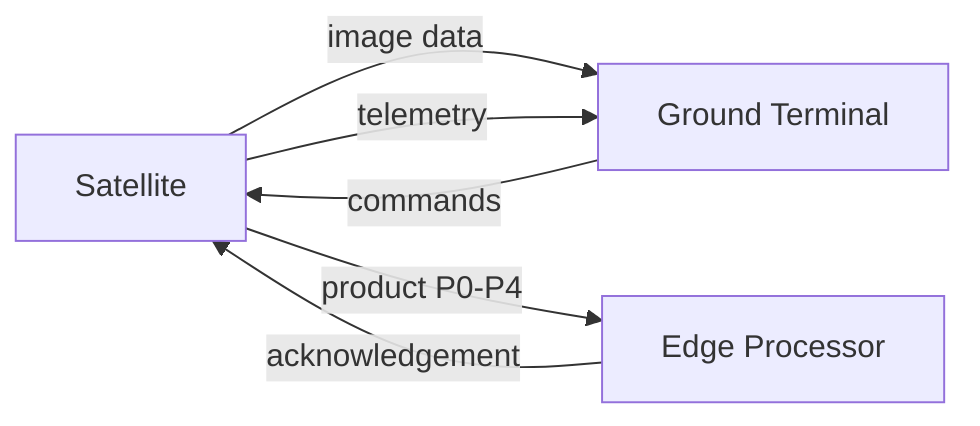

# Interfaces

## Formal Interfaces

Data formats
* Raw imagery: GeoTIFF, 16 bit, 3 bands
* Metadata: JSON with timestamp, lat lon, altitude
* Quicklook: JPEG 75 quality
* ROI: GeoTIFF subset

Units
* Time: seconds
* Data: bytes
* Energy: joules
* Rate: bits per second

Rates
* Downlink nominal 10 to 100 Mbps
* Processor throughput 50 to 200 MB/s

Timing budgets
* TFUP target less than 60 s
* TCP target less than 600 s

Energy budgets
* Processing energy per byte 1e-8 to 1e-7 J/B
* Tx energy per byte 8e-8 J/B

## Allocation Table

Function | Hardware block
Compression | COTS processor
Quicklook | FPGA
ROI extraction | COTS processor
Progressive delivery | Mass Memory + Radio
Storage management | Mass Memory
Contact scheduling | Onboard processor

## N2 Diagram

## Interface Standards

All interfaces follow documented units and formats. Changes require ADR update.
