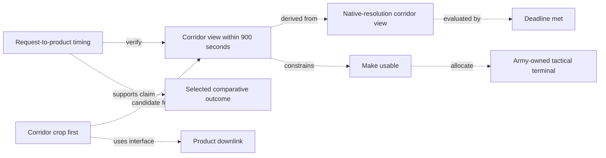
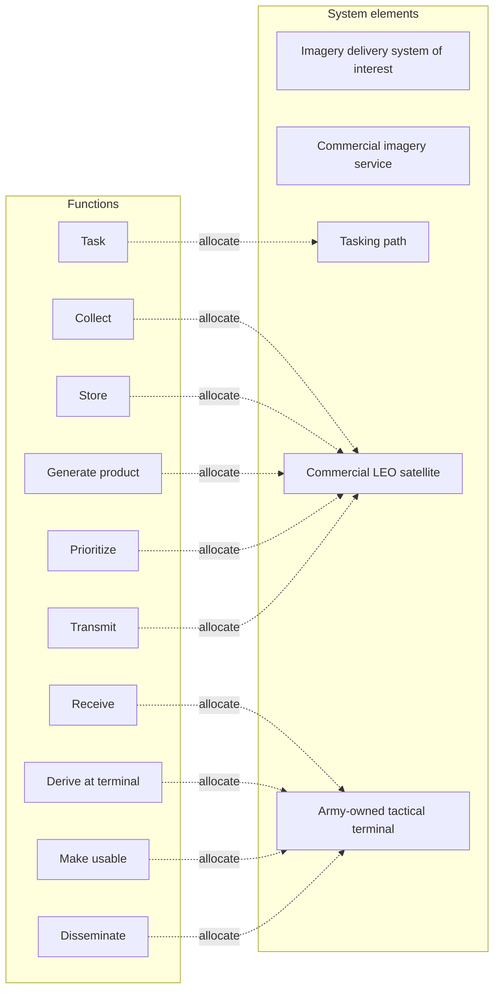
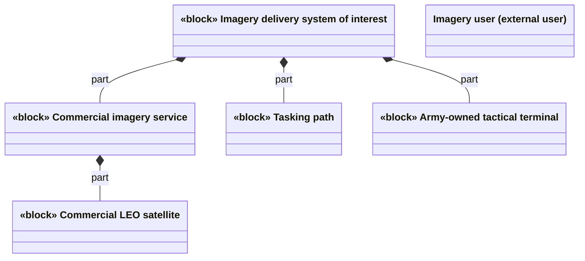
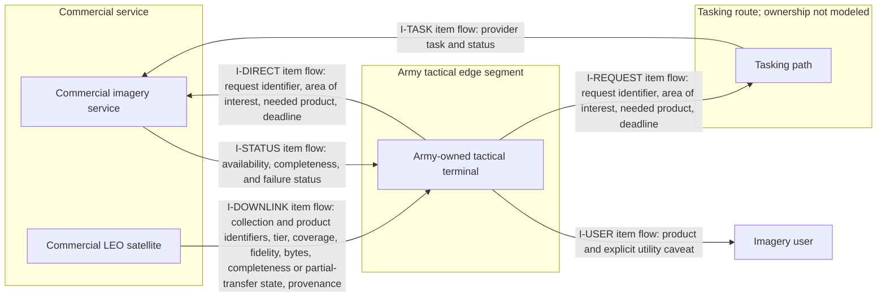
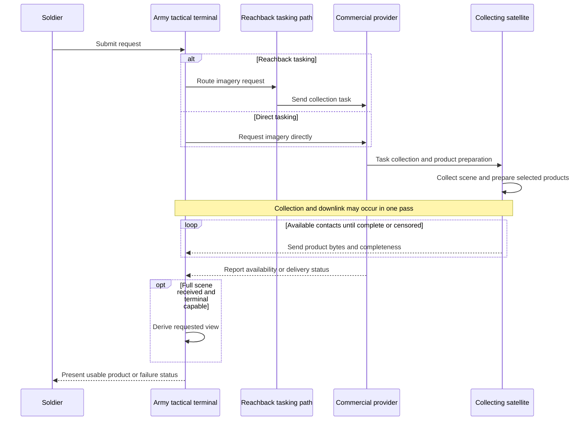
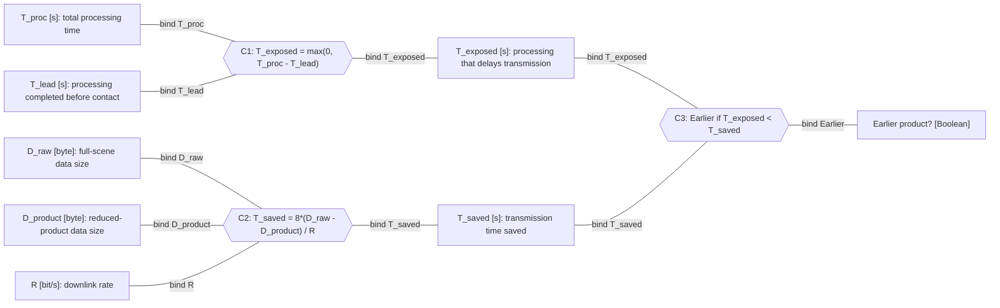
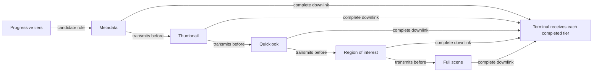
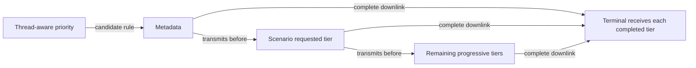

# Model views

> Generated from the `model/` catalogs. Diagram purposes and relationship conventions follow Lenny Delligatti's *SysML Distilled*, Chapters 3–12. Diagrams show readable names; stable IDs remain in node keys and reference tables. These Mermaid views are analogues, not formal SysML diagrams.

## Need-to-evidence trace

**Question:** How does one notional need reach candidate, interface, and bounded evidence?

The corridor-detail need connects to a proposed requirement, responsible behavior, an alternative, and a bounded simulation claim. The selected comparison cites its trial and summary files in [Model catalog](MODEL_CATALOG.md). Full relationship inventory: [Traceability](TRACEABILITY.md).

## Logical delivery activity

**Question:** What happens from request to usable imagery?

Arrows show control sequencing and guarded alternatives, not data-object flow. This logical view does not assign behaviors to parts; the separate allocation view shows that relationship. Incomplete or late delivery is represented in the product-state view.

```mermaid
flowchart LR
    n_F_01["Task"]
    n_F_02["Collect"]
    n_F_03["Store"]
    n_F_04["Generate product"]
    n_F_05["Prioritize"]
    n_F_06["Transmit"]
    n_F_07["Receive"]
    n_F_08["Derive at terminal"]
    n_F_09["Make usable"]
    n_F_10["Disseminate"]
    n_F_01 -->|precedes| n_F_02
    n_F_02 -->|precedes| n_F_03
    n_F_03 -->|precedes| n_F_04
    n_F_04 -->|precedes| n_F_05
    n_F_05 -->|precedes| n_F_06
    n_F_06 -->|precedes| n_F_07
    n_F_07 -->|if full scene and capable| n_F_08
    n_F_07 -->|if sufficient as received| n_F_09
    n_F_08 -->|if sufficient and timely| n_F_09
    n_F_09 -->|precedes| n_F_10
```

## Function allocation

**Question:** Which system element performs each function?

Dashed allocation dependencies point from behavior to the receiving system element, following SysML allocation direction. All candidates currently inherit the same element allocations; their execution modes differ in the catalog.

## System structure

**Question:** Which physical and organizational elements participate?

This block-definition view uses composition to show parts contained by the system and provider. The soldier-facing user is external to the system boundary.

## Provider–terminal interfaces

**Question:** What information crosses each interface?

This internal-block view shows connected parts and labels each connector with the information exchanged. Interface records define the exchange contract; the interface itself is not shown as a transmitted item.

## Delivery sequence

**Question:** When do collection, contact, and terminal derivation occur?

The sequence allows same-pass delivery and byte carryover; it does not claim every request succeeds.

## Product state

**Question:** How can delivery progress or fail?

A product is usable only after complete delivery and any required terminal derivation.

```mermaid
stateDiagram-v2
    [*] --> Requested
    Requested --> Collected: access and collection
    Requested --> Unserved: no collection before horizon
    Collected --> Ready: product generated or raw retained
    Ready --> Partial: contact carries some bytes
    Partial --> Partial: next contact carries more bytes
    Ready --> Ready: contact interrupted or denied
    Partial --> Partial: contact interrupted; bytes retained
    Ready --> Received: whole product in one contact
    Partial --> Received: remaining bytes delivered
    Received --> Derived: full scene and capable terminal
    Received --> Usable: sufficient and within deadline
    Derived --> Usable: sufficient and within deadline
    Ready --> Censored: evaluation horizon ends
    Partial --> Censored: evaluation horizon ends
    Received --> Late: complete after deadline
    Received --> Insufficient: coverage or fidelity inadequate
    Received --> MissingPrior: change requested without prior reference
    Derived --> Insufficient: coverage or fidelity inadequate
    Derived --> Late: completed after deadline
    MissingPrior --> FallbackScene: new scene only; no change product
    Usable --> [*]
    Censored --> [*]
    Insufficient --> [*]
    Late --> [*]
    FallbackScene --> [*]
    Unserved --> [*]
```

## Parametric timing constraint

**Question:** When can product reduction save exposed delivery time?

In this Mermaid analogue, rectangular nodes stand for value properties, hexagons stand for constraint blocks, and undirected labeled lines stand for binding connectors. The view does not encode SysML parameter directions or a formal constraint model. Sizes are bytes, rates are bits per second, and the factor of 8 converts bytes to bits. This is a first-order crossover model, not the full contact simulation.

## Candidate product order: Raw full scene with terminal derivation

**Question:** Which products does Raw full scene with terminal derivation prioritize?

This flow view communicates product order, not activity control flow or functional allocation. Labeled arrows mean transmission priority. The model catalog defines each candidate's complete allocations and execution modes.

## Candidate product order: Progressive tiers

**Question:** Which products does Progressive tiers prioritize?

This flow view communicates product order, not activity control flow or functional allocation. Labeled arrows mean transmission priority. The model catalog defines each candidate's complete allocations and execution modes.

## Candidate encoding choice: Contact-aware full delivery

**Question:** How does contact margin choose full-scene encoding?

This flow view shows the conditional encoding choice and following transfer. It is not an activity control-flow or functional-allocation diagram. The model catalog defines the full candidate behavior.

## Candidate product order: Thread-aware priority

**Question:** Which products does Thread-aware priority prioritize?

This flow view communicates product order, not activity control flow or functional allocation. Labeled arrows mean transmission priority. The model catalog defines each candidate's complete allocations and execution modes.

