# Model views

> Generated from the `model/` catalogs. View purposes are organized around Lenny Delligatti's *SysML Distilled*, Chapters 3–12; [modeling conventions](../MODELING_PLAN.md) record the semantic mapping and sources. Diagrams show readable names; stable IDs remain in node keys and reference tables. These Mermaid views are analogues, not formal SysML diagrams.

## Need-to-evidence trace

**Question:** How does one notional need reach candidate, interface, and bounded evidence?

The corridor-detail need connects to a proposed requirement, responsible behavior, an alternative, and a bounded simulation claim. The selected comparison cites its trial and summary files in [Model catalog](MODEL_CATALOG.md). Full relationship inventory: [Traceability](TRACEABILITY.md).

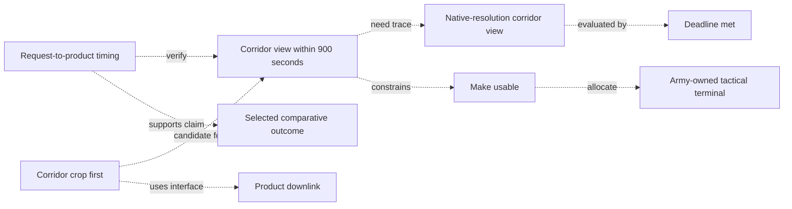

## Soldier-facing use cases

**Question:** Which services does the imagery delivery system provide to the soldier?

This black-box view places the soldier outside the named system subject and shows the two services the soldier uses. It omits internal behavior and does not imply operational capability.

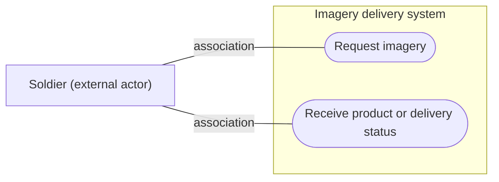

## Logical delivery activity

**Question:** What happens from request to usable imagery?

Arrows show a successful product path, not data-object flow or the engine's repeated transfer loop. The decision chooses direct sufficiency or required terminal derivation; the merge accepts either path without waiting for both. Failed paths appear in the lifecycle view. Candidate preparation and transmission can overlap across products; this coarse activity does not impose a batch barrier. Allocation is shown separately.

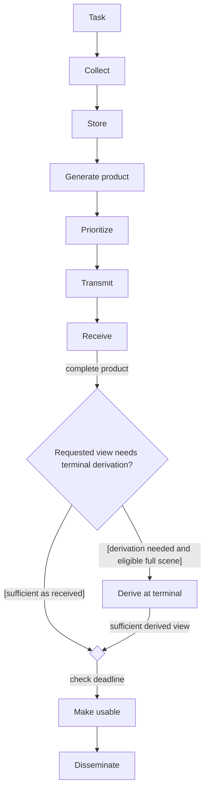

## Function allocation

**Question:** Which system element performs each function?

Each grouped list names individual functions with the same owner. Its dashed allocation dependency applies to every listed function and points to the receiving element. All candidates inherit these owners; candidate execution modes and the individual allocation records remain in the catalog.

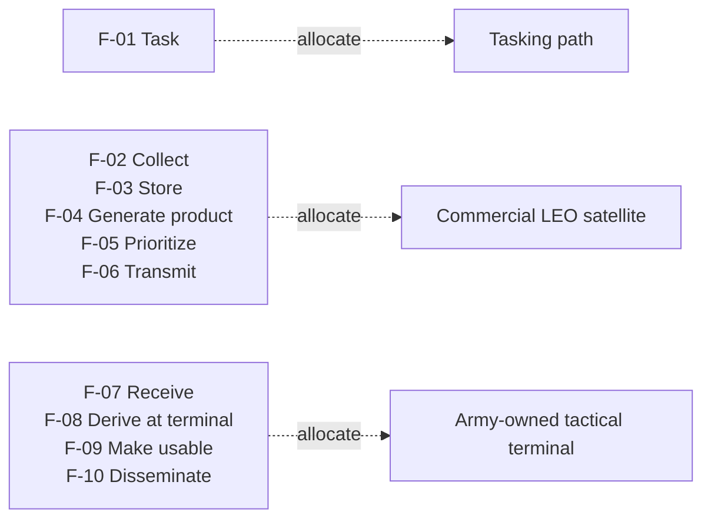

## System structure

**Question:** Which physical and organizational elements participate?

This block-definition view uses composition to show parts contained by the system and provider. The soldier-facing user is external to the system boundary.

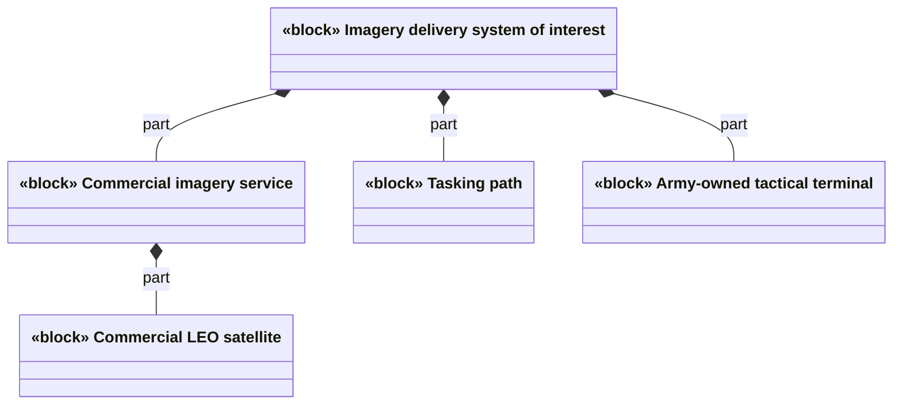

## Provider–terminal interfaces

**Question:** What information crosses each interface?

This internal-block analogue scopes the participating parts within the system of interest and leaves the user outside. Arrows describe item-flow direction, with interface IDs and exchange names. The full fields remain in the [interface inventory](MODEL_CATALOG.md#interfaces). Ports, typed part properties, multiplicities, and protocols are not specified.

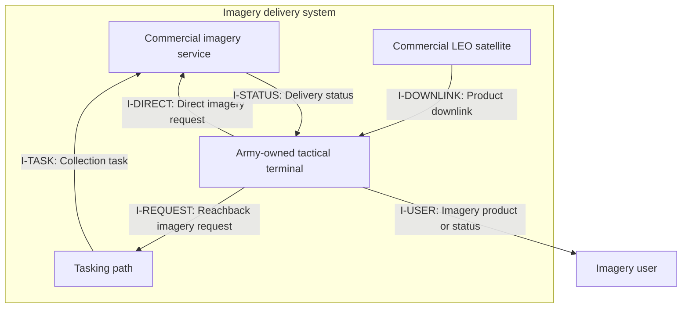

## Delivery sequence

**Question:** When do collection, contact, and terminal derivation occur?

Remote exchanges use solid open-arrow signal notation; self calls use filled arrows. Dashed replies are reserved for an explicitly modeled return. Product availability and conditional terminal derivation occur within the contact loop, before the candidate sequence necessarily ends. Message routes and status delivery are conceptual obligations, not simulated transport behavior.

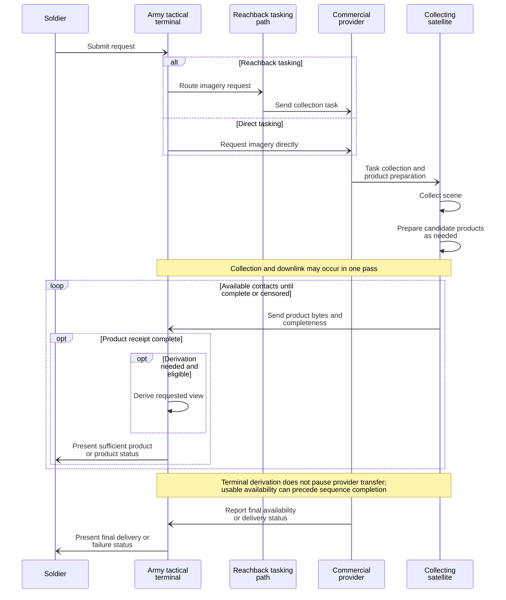

## Product state

**Question:** How can delivery progress or fail?

This lifecycle combines product transfer states with request-level outcomes. Guard aliases: prior_ok means any required prior condition is met; direct_ok means sufficient as received; derive_ok means derivation is needed and eligible; timely and late refer to the request deadline. Full guard expressions remain in the system catalog. Choices separate direct sufficiency, derivation, and failure. Timing events and executable priorities are unspecified. MissingPrior and FallbackScene are conceptual obligations, not a change algorithm.

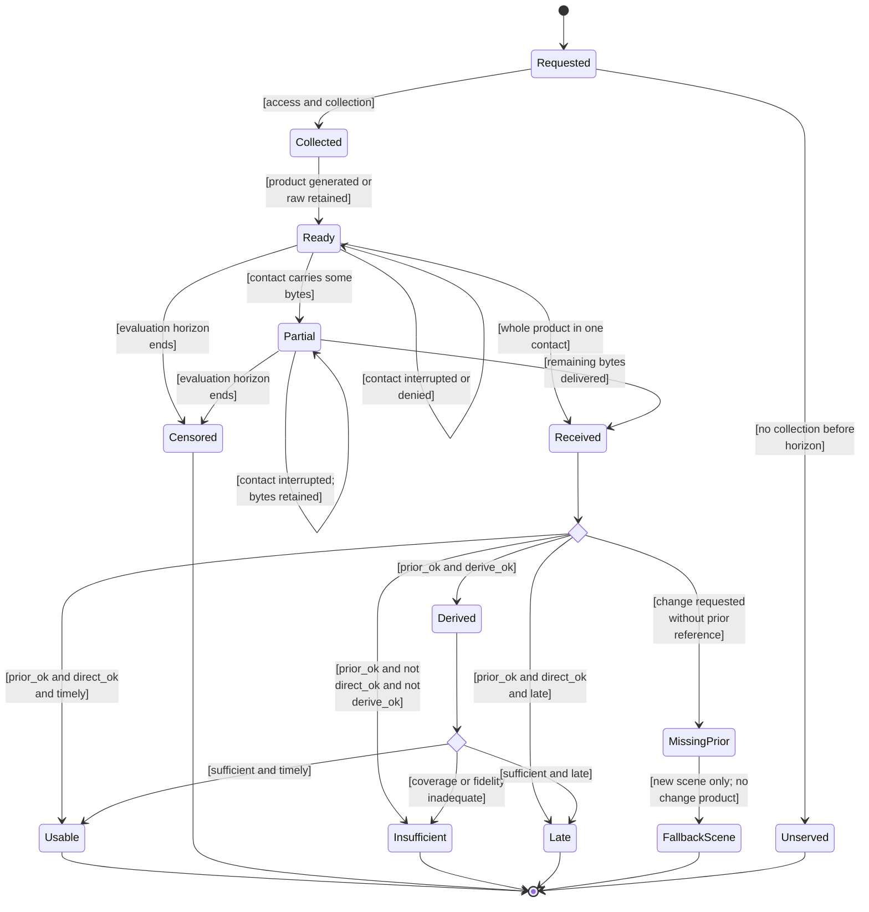

## Corridor product state

**Question:** How is the fresh corridor request assessed?

This manuscript view omits prior-reference branches, since the corridor request needs a new scene. It inherits the delivery and assessment transitions with compact guard labels; named outcomes end this assessment, with final-node connectors omitted. Direct means sufficient as received; derive_ok means needed and eligible terminal derivation; no sufficient path means neither direct sufficiency nor eligible derivation. Timely and late refer to the request deadline. The full guards remain in Product state and the system catalog.

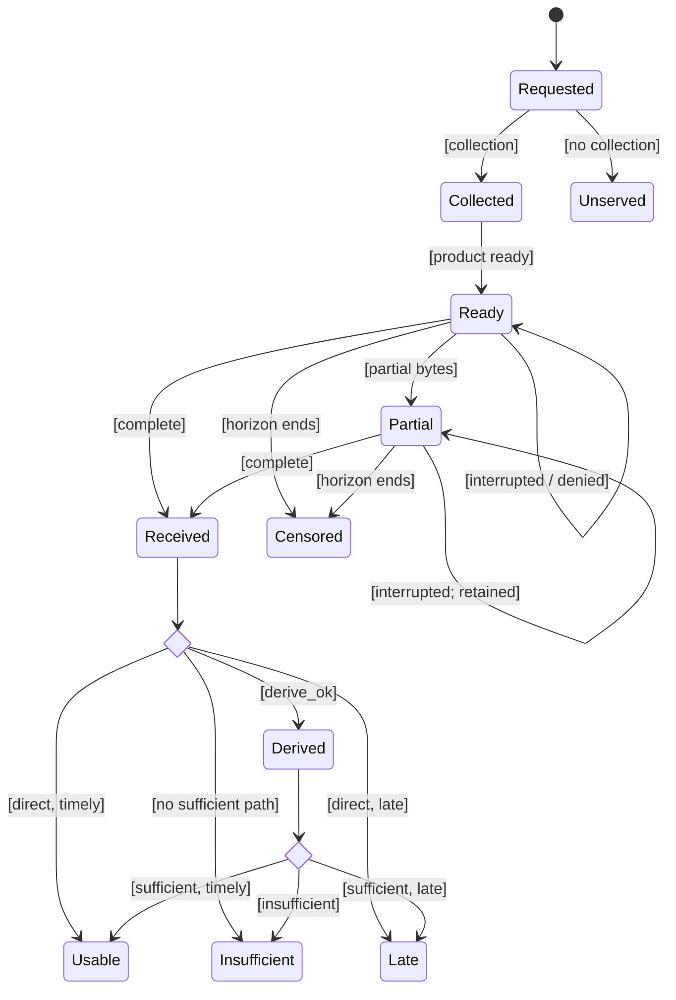

## Parametric timing constraint

**Question:** When can product reduction save exposed delivery time?

Rectangles stand for value properties and hexagons for constraint properties, which are usages of constraint definitions. Undirected bindings equate each value with the named constraint parameter; they do not show calculation order. Parameter ports and constraint types are omitted in this analogue. Sizes are bytes and rates are bits per second. The first-order crossover is separate from the contact simulation.

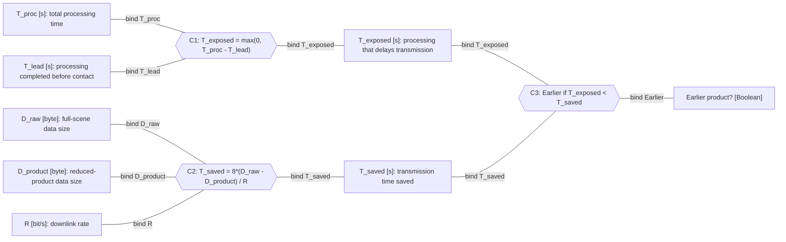

## Candidate product order: Raw full scene with terminal derivation

**Question:** Which products does Raw full scene with terminal derivation prioritize?

This flow view communicates product order, not activity control flow or functional allocation. Labeled arrows mean transmission priority. The model catalog defines each candidate's complete allocations and execution modes.

## Candidate product order: Progressive tiers

**Question:** Which products does Progressive tiers prioritize?

This flow view communicates product order, not activity control flow or functional allocation. Labeled arrows mean transmission priority. The model catalog defines each candidate's complete allocations and execution modes.

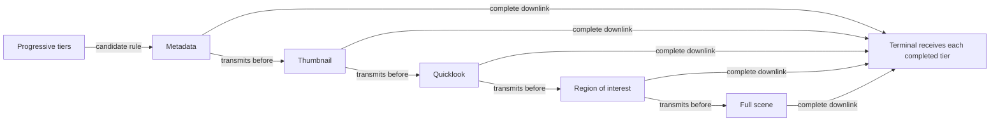

## Candidate encoding choice: Contact-aware full delivery

**Question:** How does contact margin choose full-scene encoding?

This flow view shows the conditional encoding choice and following transfer. It is not an activity control-flow or functional-allocation diagram. The model catalog defines the full candidate behavior.

## Candidate product order: Thread-aware priority

**Question:** Which products does Thread-aware priority prioritize?

This flow view communicates product order, not activity control flow or functional allocation. Labeled arrows mean transmission priority. The model catalog defines each candidate's complete allocations and execution modes.

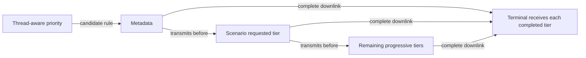
