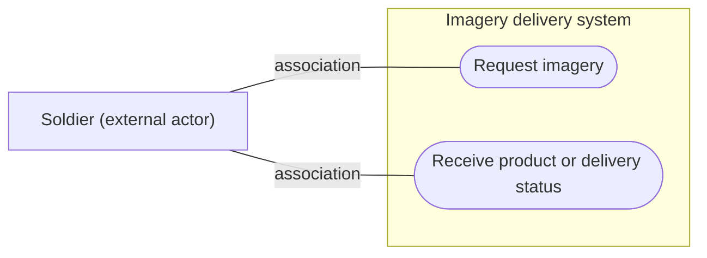
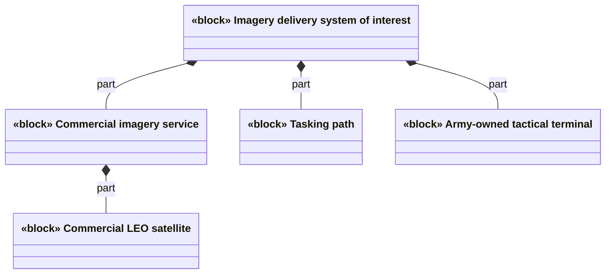
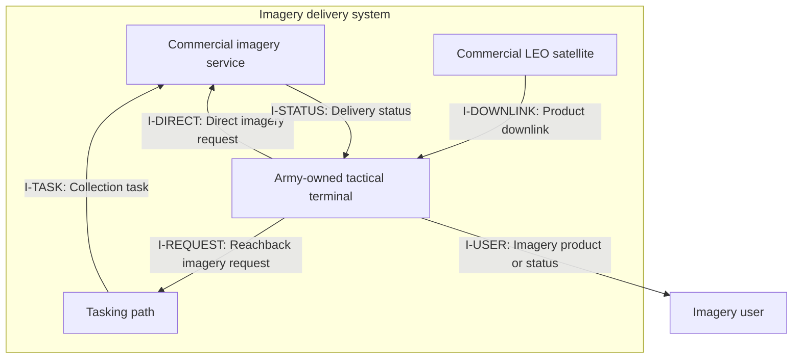
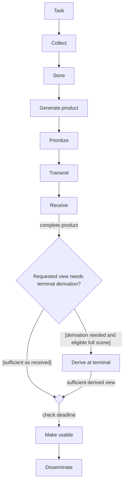
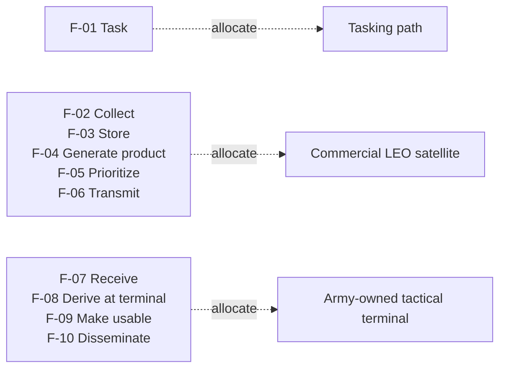
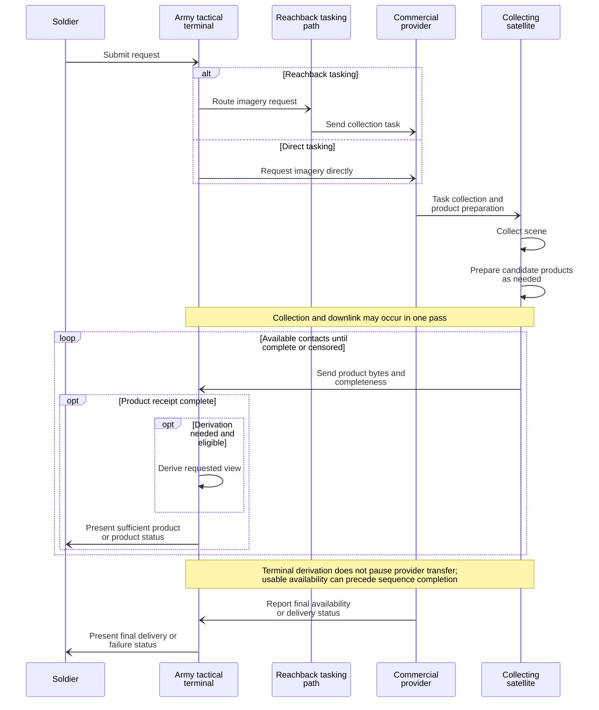
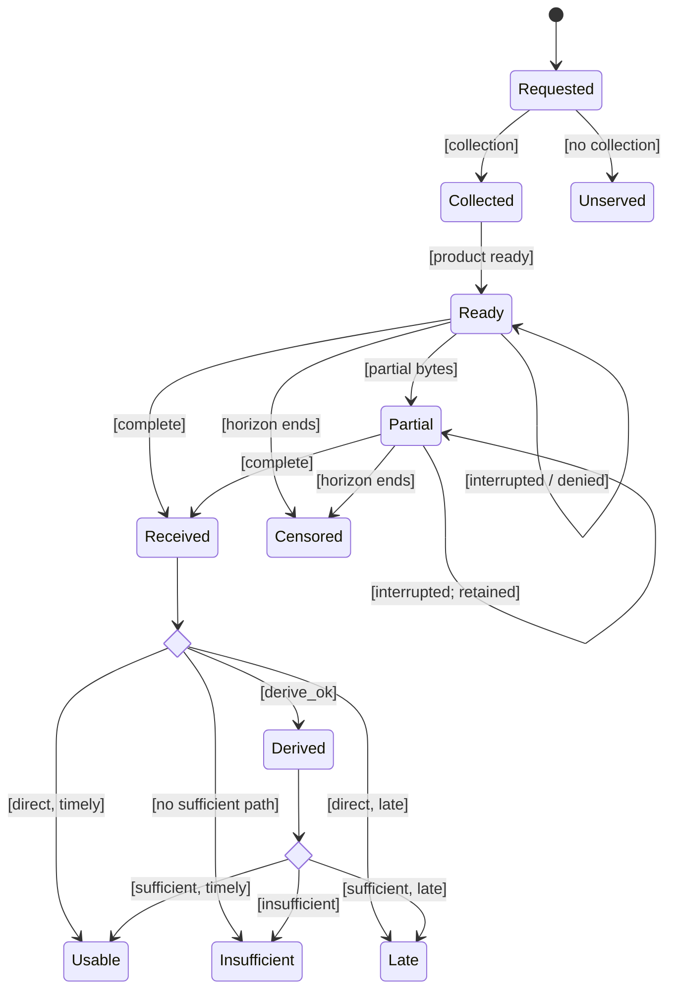
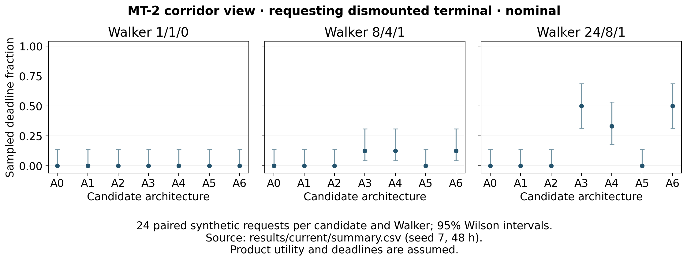
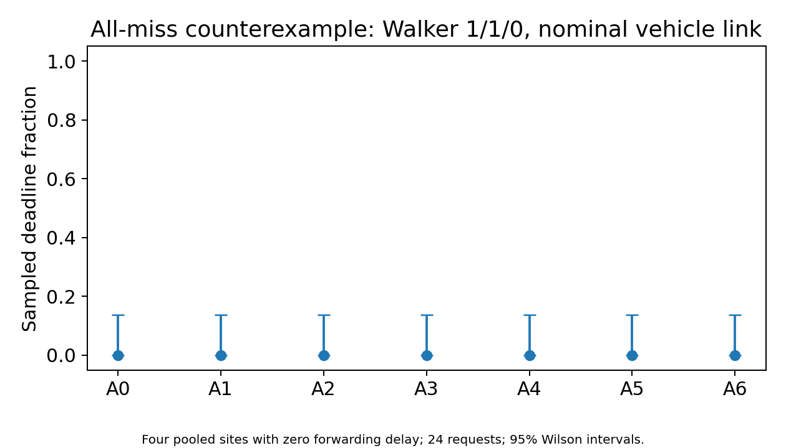
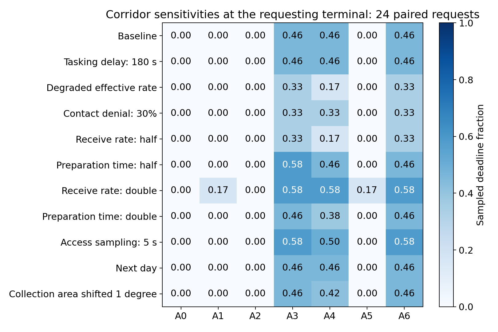

# Function Allocation and Interface Design for Commercial Satellite Imagery Delivery

Noah Stephenson

## Abstract

Commercial low Earth orbit imagery services connect provider-operated satellites with Army-owned tactical terminals. A soldier requesting imagery needs a product that covers the requested area and arrives before the deadline. This paper presents a bounded architecture trade study of provider preparation, transmission order, and eligible terminal derivation. Tasking and collection responsibilities remain fixed. The study traces notional needs through requirements, functions, allocations, interfaces, and verification, then compares seven delivery approaches using a shared multi-contact simulation. Individually propagated synthetic satellites provide separate collection and terminal access opportunities, with unfinished transfers carried across contacts. The principal measure is request-to-sufficient-product availability, including any terminal derivation. In one corridor case with a requesting dismounted terminal, crop-first and request-aware delivery each met the assumed 900-second deadline on 12 of 24 paired requests. Fixed progressive delivery succeeded on 8; the four other approaches had no timely deliveries. A separate sparse-constellation case retained all-miss outcomes. These results support early preparation of a fitting product under the stated contacts and rates, but do not establish a benefit from request-aware ordering over crop-first delivery. Finer access sampling changed deadline classifications in a separate sensitivity sample. The contribution is a reproducible link between architecture responsibilities and conditional delivery evidence. Product utility, physical service feasibility, and operational capability remain unvalidated; all mission scenarios and requirements are notional.

## 1. Introduction

A soldier at a tactical terminal needs an image that covers the requested area before an assumed decision time. A satellite may collect the area before it can contact that terminal. When contacts are short, delivery may take several passes. The service must choose which product to prepare and send first, while the terminal must determine whether the received product meets the request.

The National Geospatial-Intelligence Agency describes a future architecture that connects national and commercial sensors with a ground network serving users from strategic organizations to the tactical edge [1]. The Army has also described a prototype ground station for processing data from multiple sensor sources [2]. These efforts establish public context for the receiving-terminal problem. They do not define the system modeled here. I study a commercial low Earth orbit (LEO) imagery service connected to a generic Army-owned terminal.

The research question is: How should imagery functions (tasking, collection, processing, prioritization, delivery) be allocated between a commercial LEO space segment acquired as a service and an Army-owned tactical edge segment, and how does the preferred allocation shift across mission needs, terminal classes, and contested or DDIL conditions?

I examine a bounded part of this question. Tasking and collection responsibilities remain fixed, while the candidates vary provider preparation, product order, and eligible terminal derivation. Degraded conditions are represented by assumed tasking delay, reduced effective rate, and denied contacts. The requests, terminal locations, deadlines, and product utility are notional. Under these assumptions, provider preparation can make the requested view available before a full scene could support terminal derivation. That advantage depends on the requested coverage and detail, the processing time, and the contacts that remain before the deadline. The study identifies those conditions without selecting an operational service or an optimal allocation of every imagery function.

This paper makes three contributions. First, I trace one soldier need through requirements, functions, allocations, interfaces, measures, and checks. Second, I compare seven delivery approaches using a shared architecture model. Third, I use paired contact cases to show shared timing limits and conditions where product preparation or order changes modeled delivery. These contributions keep architecture decisions connected to evidence.

## 2. Prior work and modeling approach

### Architecture models and performance evidence

Earth observation architecture studies have connected user needs to space and ground elements, then assessed how those architectures affect collection and delivery. Tonetti et al. evaluated distributed observation nodes against marine-weather needs, including revisit, data latency, ground-station access, memory, and power [3]. This establishes a precedent for treating delivery as part of an architecture trade. Their broader physical assessment also shows what a timing model alone leaves unresolved. The present study holds spacecraft design outside its trade and compares delivery behavior within synthetic contact cases. It does not inherit the physical feasibility of the ONION architecture or compare its numerical performance with that system.

Ryan et al. provide a methodological precedent by linking requirements, candidate architectures, simulation inputs, and trade results [8]. Their framework includes an example using cost and performance objectives to guide design selection. This study follows the requirement-to-evidence reasoning with smaller structured catalogs and a common transfer model. However, it has no stakeholder-approved weights, service costs, or resource feasibility model with which to select a system. Its result is a conditional comparison. Combining architecture models with simulation is already established practice, and using a different user setting does not by itself establish a new method.

### Product needs, processing location, and the latency clock

Brown et al. found that latency needs depend on the data product and its application [7]. They also discuss onboard processing during the interval before downlink and the processing facilities needed after direct broadcast. This supports evaluating the path to a usable view, including work at the receiver. It does not provide the soldier deadlines used here. Their latency discussion begins at acquisition; the principal clock in this study begins when the user requests imagery. Tasking and collection wait therefore remain part of the reported outcome. A product delivered quickly after collection can still arrive too late for the request.

Caon et al. describe an EO-ALERT subsystem that coordinates processing, compression, storage, and transmission, giving compact civil-alert products precedence over lower-priority data [4]. Its reference implementation supplies hardware and software evidence that this study does not attempt to reproduce. Chien et al. describe a later civilian demonstration concept combining commercial spacecraft, onboard analysis, and compact notifications [14]. The cited paper reports development and testing toward a planned flight demonstration, rather than completed validation of every proposed capability. Together, these studies establish precedents for early onboard products. Neither supplies a measured crop size, terminal rate, or processing delay for the present comparison.

Product sequencing also differs from progressive image coding. CCSDS 122.0-B-2 specifies an embedded compressed representation that supports progressive transmission [11]. Here, A4 and A6 send separate metadata, thumbnail, quicklook, crop, and full-scene products. Each product must finish before it receives credit, and earlier products do not reduce the byte target of a later product. This models a service delivery sequence. It does not test an embedded codec, partial-image interpretation, or the quality of a decoded preview. Likewise, the assumed compressed full scene retains native spatial resolution in the model, but that label does not establish radiometric fidelity or operator usefulness.

### Download planning and interrupted delivery

Maillard et al. share download-planning decisions between ground and spacecraft to accommodate uncertain compressed data volumes while preserving priority commitments [5]. Ferrari et al. distinguish imaging, communication, and integrated scheduling problems [6]. These are precedents for decisions about competing work and shared resources. The present candidates face one active request at a time, fixed product sizes, and a declared product order. A5 uses a contact-margin rule; A6 moves the requested tier earlier in its sequence. Their names do not imply that the study evaluates autonomous replanning, fairness among users, or an optimized collection and download schedule.

Interrupted delivery also has established protocol foundations. The CCSDS File Delivery Protocol separates file metadata, received segments, and transaction status [12]. Bundle Protocol Version 7 addresses communication through intermittent connectivity and distinguishes forwarding from delivery to an application [13]. These sources provide context for preserving identity and receipt state across contacts. The simulation carries byte progress over successive contacts with the collecting satellite, but does not implement either protocol. It omits acknowledgments, retransmission costs, packet overhead, routing, and transfer between receiving sites. Its capacity and completion checks establish arithmetic consistency under an idealized transfer assumption.

### Position of this study

The literature already motivates user-specific latency, onboard preparation, prioritized delivery, and requirements-linked simulation. I combine those ideas in a reproducible, notional service-boundary study whose evidence follows a request through complete receipt and eligible terminal derivation. The emphasis is the trace between a declared information need, its product sufficiency rule, candidate behavior, and an interface consequence. This is an application and a bounded comparison, rather than a claim to have invented product-first delivery or an MBSE method. The [literature reference](../docs/reference/LITERATURE.md) records the primary sources, the claims they support, and the limits of those comparisons. The review is targeted to these architecture decisions; it does not establish that no earlier study has made a similar comparison.

### Model and analysis method

I followed selected conceptual-design activities from NASA-HDBK-1009A [9]. The work begins with a model plan and setup, defines stakeholder expectations and technical requirements, develops logical and candidate architectures, and connects them to verification evidence. The [modeling plan](../docs/MODELING_PLAN.md) records where the study follows the handbook and where its scope requires a smaller model.

NASA’s Systems Engineering Handbook describes early trade studies as comparisons of architecture alternatives against system objectives and measures, with assumptions and results recorded for review [10]. It recognizes that no single measure will represent every important objective in many studies. This study therefore reports outcomes within each mission thread and operating condition. It does not combine them into one value score because the project has no stakeholder-approved weights or cost data. The simulation supports the architecture comparison; it does not select an operational system.

Four structured catalogs define the system, architecture, assurance records, and relationships. Each element has a stable identifier, definition, and source. Typed relationships connect needs, requirements, functions, allocations, interfaces, measures, and verification cases. A validator checks the links before generating tables and Mermaid views. The diagrams use selected concepts from the Systems Modeling Language [15], but they are not formal SysML models.

The model includes one level of decomposition. It describes the service, satellite, tasking path, and terminal well enough to compare delivery responsibilities. Tasking and collection responsibilities remain fixed in the evaluated candidates. The quantitative comparison concerns provider product preparation, transmission order, and conditional terminal derivation. I do not specify spacecraft hardware, provider algorithms, or an operational message standard. This bounds the part of the allocation question examined here.

The principal outcome is the time from request to a complete product that satisfies the assumed need, including any terminal derivation. For a successful path, this equals request-to-collection delay plus collection-to-product-arrival time plus terminal derivation time. The middle interval includes provider preparation, contact wait, transmission, and gaps between contacts. Those activities can overlap, so they cannot be added as independent delays. The first completed product may be metadata and is not necessarily usable imagery. Sufficient availability, full-scene receipt, and completion of the entire candidate sequence are separate events. A complete compressed product has completeness one relative to its encoded byte target, regardless of its size relative to the raw scene.

Before interpreting contact cases, I check the continuous-transfer condition: exposed processing time must be smaller than the transmission time saved by removing bytes. With byte sizes D_raw and D_product, bit rate R, and processing lead T_lead, this is max(0, T_proc - T_lead) < 8(D_raw - D_product)/R. The [hand calculation](../docs/HAND_CALC_BREAK_EVEN.md) checks units and selected inputs. However, that inequality compares transfer timing under continuous access. It cannot establish coverage, fidelity, or delivery by a request deadline when contacts are discontinuous. The contact analysis is needed to determine whether the fitting product actually finishes in time.

## 3. Soldier need and system boundary

The principal user is a soldier waiting for a requested image at the terminal. The soldier needs the system to report whether the product is pending, partial, complete, late, or unavailable. A complete product is usable in the model only when it meets the assumed coverage, detail, terminal capability, and deadline conditions. The four [notional mission threads](../docs/MISSION_THREADS.md) are a whole-area update (MT-1), corridor detail (MT-2), comparison with a prior image (MT-3), and repeated whole-area updates (MT-4).

**Fig. 1. Soldier use-case view.** The soldier is outside the named system and requests imagery or receives a product or its delivery status.

The system of interest includes the commercial imagery service, its satellite, a tasking path, and the Army terminal. The soldier remains outside the boundary. Collection and terminal contact are separate events, although the same satellite can collect and transmit during one pass.

**Fig. 2. System structure.** Composition identifies the service, satellite, tasking path, and terminal as parts of the system boundary.

The terminal cannot judge delivery from image bytes alone. It needs a product identifier, requested footprint, fidelity description, and completeness status. The service must preserve product identity when contact ends before transfer is complete. Figure 3 shows the exchange direction across the provider, terminal, tasking path, and soldier boundary. Interface IDs connect the compact view to the full [field inventory](../docs/reference/MODEL_CATALOG.md#interfaces). Ownership of the tasking route is unspecified.

**Fig. 3. Provider and terminal exchanges.** Labels identify each interface and exchange; the catalog records its fields. Arrows indicate item-flow direction, without specifying a vendor message format.

I wrote the requirements as proposed, testable statements for this notional system. For the corridor thread, REQ-THREAD-002 asks for a complete native-resolution crop within 900 seconds of request. REQ-IF-001 requires product identity, tier, coverage, fidelity, and completeness in the downlink exchange. The [requirements model](../docs/REQUIREMENTS.md) connects each statement to its source need and planned verification.

## 4. Logical behavior and candidate allocations

The logical behavior begins with a request, then collection, storage, product preparation, prioritization, transmission, receipt, and terminal use. The terminal derives a smaller view only from a complete full scene and only when its class and remaining time permit. Figure 4 shows this sequence before assigning each function to an element.

**Fig. 4. Logical delivery activity.** The decision and merge select one sufficient-product path. This coarse view does not impose batch preparation or depict the repeated transfer loop. Incomplete and late outcomes are shown in Fig. 7.

The seven candidates change product preparation or transmission order. A0 sends a raw full scene for possible terminal derivation. A1 sends a compressed full scene. A2 and A3 send a whole-scene quicklook or declared-area crop before the full scene. A4 sends fixed progressive tiers. A5 chooses raw or compressed full-scene delivery once, using the first contact's margin. A6 sends metadata, then the scenario's needed tier, then the remaining products in catalog order. An incomplete product keeps its place across contacts; these candidates do not skip it to find a smaller product that fits.

**Table I. Candidate delivery approaches.** The names describe the modeled choice; the stable identifiers connect each choice to its complete allocation record.

| ID | Delivery approach |
|---|---|
| A0 | Raw full scene, followed by eligible terminal derivation |
| A1 | Compressed full scene |
| A2 | Whole-scene quicklook before the full scene |
| A3 | Declared-area crop before the full scene |
| A4 | Fixed progression from metadata to full scene |
| A5 | Raw or compressed full scene chosen once from the first-contact margin |
| A6 | Metadata, requested product, then remaining products in catalog order |

Figure 5 shows which element performs each function. The common function owners remain the same across candidates; their product and execution modes differ. A0 relies on receipt of the full scene before the terminal can derive a requested crop. A3 supplies that crop from the provider, reducing the work that must wait until terminal receipt. F-04 and F-08 therefore express alternative paths to the requested view within the common ownership map. They do not represent a search over all possible function owners. The [allocation catalog](../docs/ALLOCATION_SPACE.md) records those differences, including product sizes and boundary exchanges.

**Fig. 5. Function allocation.** Each dashed dependency allocates every function in its grouped list to the indicated element. The catalog retains individual allocation records.

Product size alone does not establish usefulness. A native-resolution crop can meet the corridor need while leaving the rest of the scene unseen. A quicklook has whole-scene coverage but may lack the required detail. A full scene can support a terminal-derived view only when processing finishes in time. The [product checks](../tests/test_product_sufficiency.py) test these conditions; they do not test whether a soldier can interpret the image.

## 5. Representative corridor thread

I trace the corridor request from N-02 to REQ-THREAD-002, then through product generation, prioritization, transmission, and receipt. A0 waits for the full scene before terminal derivation. A3 sends the corridor crop first. In either case, I-DOWNLINK must carry the product identity, footprint, fidelity, and completeness so the terminal can apply the same sufficiency and deadline checks. V-TIMING compares complete-product delivery with the assumed 900-second limit. Figure 6 follows the exchanges through interrupted contact and receipt. Direct and reachback tasking are included because tasking delay is part of the request clock.

**Fig. 6. Request-to-terminal sequence.** Complete products can become sufficient during the contact loop, before the candidate sequence ends. Remote arrows represent information signals; message transport and status delivery remain conceptual.

This trace separates a delivery result from an interface design implication. The simulation uses declared footprint and fidelity labels to decide whether the complete crop is sufficient. It does not exchange those fields with a real terminal or verify their truth from image pixels. The resulting interface obligation is to make those properties available and interpretable at receipt. Model inspection checks that the obligation is represented; timing tests check the modeled delivery rule. Neither check establishes interoperability or image utility. The soldier-facing story therefore ends at modeled availability, with interpretation of the image remaining an open validation question.

The lifecycle view distinguishes partial receipt from a complete product and then assesses the request. Figure 7 follows the fresh corridor request, which needs no prior reference. It records missed collection, incomplete receipt, late availability, and inadequate coverage or fidelity. In the compact guards, direct means sufficient as received and derive_ok means terminal derivation is needed and eligible. No sufficient path means neither direct sufficiency nor eligible derivation. Timely and late refer to the request deadline. The broader [lifecycle view](../docs/reference/VIEWS.md#product-state) retains the conceptual missing-prior condition for a comparison request. These views explain delivery outcomes without specifying an executable state machine or an implemented change product.

**Fig. 7. Corridor product delivery and request assessment.** Usable availability requires complete receipt, sufficient declared properties, eligible derivation when needed, and timely availability. Named outcomes end the assessment; final-node connectors and prior-reference branches are omitted from this scoped view.

## 6. Results and architecture implications

I simulated individual satellites in three synthetic Walker constellations. The labels 1/1/0, 8/4/1, and 24/8/1 give the satellite count, orbital-plane count, and phasing. Collection and terminal locations are separate. The collecting satellite can downlink during the same pass, and unfinished bytes carry across later contacts. For MT-1 through MT-3, each configuration contains 24 paired single-request trials per candidate. The candidates share the same seeded request and contact-denial inputs within a configuration. Different configurations use independently drawn requests. Repeated monitoring uses a separate independent-opportunity evaluation without reserving capacity across collections. The [current evidence](../results/current/) records the inputs, trials, summary measures, and audit.

The results follow the same request path. I first examine where tasking, collection, and contact timing prevent every candidate from meeting the deadline. I then examine where the product prepared by the provider changes what can reach the soldier in time. The paired outcomes explain modeled architecture behavior under these conditions.

For the whole-area update thread (MT-1), every candidate recorded zero timely deliveries in 21 of the 24 tested combinations of constellation, site count, terminal class, and condition. In most tested conditions, changing product order did not overcome the combination of tasking delay, collection timing, contact availability, and the short deadline. The result identifies an upstream architecture limit: delivery policy cannot make the service collect or contact the terminal earlier than the modeled opportunities allow. It does not isolate which timing component caused each miss.

The corridor-detail thread (MT-2) shows both sides of that distinction. In the 1/1/0 case with four vehicle-terminal sites under nominal conditions, all seven alternatives achieved 0 of 24 deadline successes. These sites form one logical connected receiver with instantaneous sharing, rather than four isolated terminals. Three requests had no collection; the other 21 still did not produce a timely usable product. It would be inaccurate to attribute all misses to absent access.

In the 24/8/1 case with one dismounted terminal under nominal conditions, A3 and A6 each delivered the native-resolution corridor product on all 24 requests. Twelve arrived within the assumed 900-second limit and twelve arrived late. A4 delivered the corridor product on 22 requests, with 8 timely deliveries. A0, A1, A2, and A5 had no deadline successes in this case. The 95% Wilson intervals are 31.4-68.6% for A3 and A6, 18.0-53.3% for A4, and 0-13.8% for the other four approaches. These paired outcomes show that a product matching the requested area can reach the terminal in time more often than a full-scene-only approach under this specific link and deadline assumption. The intervals are broad and do not establish a general ranking.

This case does not show a benefit from A6’s prioritization over A3’s fixed corridor-first order. A3 and A6 had the same success outcomes and delivered tiers across the paired requests. After applying the same crop size to both candidates, A6’s successful deliveries took 0.033 seconds longer because it sent metadata first. Because the case contains one active request thread, it cannot test whether need-aware priority helps when requests compete for a contact. The evidence supports early delivery of a product that fits the request. It does not establish a benefit from dynamic priority logic.

The [paired differences](../results/current/principal_paired_differences.csv) resample whole request pairs, preserving the shared conditions in each comparison. They supplement the Wilson intervals for individual candidate proportions; overlapping individual intervals are not a test of the paired difference. Latency differences are reported only for requests where both candidates were timely. This excludes misses and cannot describe overall service latency. A zero-width bootstrap interval when every observed pair has the same difference reflects the sample available for resampling. It does not establish equivalence outside those requests. These are exploratory comparisons within selected synthetic cases, without adjustment for the many candidate and scenario comparisons.

Figure 8 places the principal case alongside the other constellation cases for one requesting dismounted terminal. Figure 9 retains the all-miss pooled-site counterexample. The [claim filters](../results/current/claims.json) identify exact rows behind the reported counts. None of the seven candidates received a full scene within 3,600 seconds in the principal corridor case. This separates timely availability of the requested crop from receipt of the scene needed for broader terminal work.

**Fig. 8. Corridor delivery to one requesting terminal.** Each candidate uses 24 paired requests within its Walker case. Points show timely-delivery fractions and bars show 95% Wilson intervals. Requests differ across Walker cases, so the panels do not isolate constellation size. Source: [summary.csv](../results/current/summary.csv), single_request, MT2_ROUTE_RECON_FIRST, DISMOUNTED_MANPACK, NOMINAL, terminal_sites = 1.

**Fig. 9. All-miss corridor counterexample.** All candidates missed the deadline on 24 paired requests under the vehicle-link assumption. The four sites are one connected receiver with zero forwarding delay. Bars show 95% Wilson intervals. Source: [summary.csv](../results/current/summary.csv), single_request, MT2_ROUTE_RECON_FIRST, VEHICLE_MOUNTED, NOMINAL, terminal_sites = 4, walker = 1/1/0.

These illustrative cases differ in receiver, terminal rate, and constellation assumptions, and use independently drawn requests. Their contrast does not isolate the effect of adding satellites. The controlled comparison is between candidates within each case. At the principal dismounted rate, the continuous raw-scene transfer time already exceeds the corridor deadline, even before tasking or collection wait. Reduced products still need an eligible contact to finish, and their success cannot be inferred from that lower-bound calculation alone.

A separate set of 24 paired corridor requests tests sensitivity. At 30-second access sampling, A3 and A6 each had 11 timely deliveries; at 5-second sampling, each had 14. The numerical timing precision therefore does not establish stable orbital deadline classifications. The degraded MT-1 tasking delay is 180 seconds, which already exceeds its 120-second deadline before collection or transfer. Product order cannot resolve this analytical limit.

The sensitivity draws form a separate paired sample, so their baseline count should not be read as a rerun of the principal requests. The [sensitivity summary](../results/current/sensitivity_summary.csv) retains isolated tasking, rate, denial, processing, time, and geometry changes. Equal aggregate counts can conceal changes in which requests succeed. A shorter processing time can also move a product boundary into a different contact and change the consequence of sending metadata first. These cases qualify the preparation finding. They do not demonstrate convergence of the access calculation or stability across real service geometries.

**Fig. 10. Corridor sensitivity outcomes.** Each row changes one assumption from the separate sensitivity baseline, with 24 paired requests per candidate. Entries show sampled timely-delivery fractions. Halving the preparation time produced different outcomes for A3 and A6, while finer access sampling changed both candidates' classifications. Source: [sensitivity_summary.csv](../results/current/sensitivity_summary.csv), exact case and architecture_id for each cell. These are sensitivity findings within the assumed geometry.

The broader architecture comparison follows the soldier’s product need. A whole-area request requires whole-scene coverage; a corridor request can be served by a native-resolution crop. A prior-image comparison also requires an available reference, but the current model does not perform change detection. Repeated whole-area updates are evaluated separately as independent delivery opportunities. These distinctions matter because a smaller product is not automatically a more useful one.

The [trade study](../docs/TRADE_STUDY.md) records the other candidate outcomes. The intervals describe sampling uncertainty only. They do not capture uncertainty in the assumed geometry, product utility, rates, tasking delays, or deadlines.

## 7. Discussion and conclusion

### Benefits

The model keeps one soldier need connected to the functions and interfaces that determine what reaches the terminal. For the corridor thread, the receiver needs product identity, coverage, detail, and completeness before it can apply the assumed deadline rule. This trace lets a reviewer see which part of the result comes from the architecture and which part comes from an assumption.

The selected cases also separate shared timing limits from delivery choices. In the sparse-constellation case, every candidate missed the assumed deadline, even though most requests were collected. In the larger-constellation case, an early corridor product arrived on time more often than the full-scene approaches. A3 and A6 had identical deadline outcomes in that principal case. This makes product preparation the supported distinction there, while leaving the value of competing-request priority unresolved. The all-miss case also prevents treating an early crop as a remedy for every delay in the request path.

The architecture implication follows the same request through the service boundary. Provider preparation requires an agreed footprint and product definition before collection; terminal derivation requires a complete eligible scene and time after receipt. The terminal needs enough product information to distinguish a usable crop, an insufficient preview, and an incomplete transfer. Receipt at a supporting site would add another delivery obligation unless sharing were instantaneous, as assumed in the pooled cases. These are responsibilities a future interface would need to resolve. The simulation does not establish a contract, a message format, or the cost of either path.

### Shortcomings

The geometry, terminal rates, tasking delays, product sizes, and deadlines are synthetic or sensitivity inputs listed in the [assumption register](../docs/ASSUMPTIONS.md). The model assumes that a product with the stated footprint and spatial resolution is useful. I have not tested that assumption with soldiers or image-quality measurements. The prior-reference thread checks for a missing input but does not produce a change image.

The model does not establish the value of prioritization when several requests compete for contact time. The four-site cases pool reception opportunities without modeling transfer between sites and the requesting terminal. Repeated collections are evaluated independently, so their transfers do not share a capacity budget. This limits those cases to an assumed shared receiver and independent delivery opportunities. The current evidence also omits energy, storage, and fielded interface behavior. The evidence supports a comparison of product preparation and timing assumptions within these limits.

Collection is an elevation-based proxy without optical pointing geometry, illumination, clouds, or collection duration. The simulation also assumes that modeled transmitted bytes arrive without retransmission or decoding delay beyond the stated terminal derivation. Internal tests can reject false completions and capacity violations, but cannot validate those physical assumptions. The finer access scan changes deadline classifications, and the selected cases span only a short synthetic propagation interval. Additionally, the literature offers related concepts and methods, rather than calibration of the notional values. A claimed operational advantage would require independent image-quality, processing, contact, interface, and user evidence.

### Conclusion

In these cases, a corridor crop helps when the available contacts can carry it before the request deadline. Terminal derivation is an alternative path only when an eligible full scene arrives with enough time left to process it. The principal evidence supports early preparation of the fitting product and does not distinguish a benefit from need-aware ordering over fixed crop-first delivery. It also shows that timely crop availability does not establish timely full-scene receipt. The architecture model connects those conditions to a need, requirement, function, allocation, interface, measure, and verification case. The broader allocation question remains partly open because tasking and collection owners, competing requests, and resource feasibility were held outside the evaluated trade. Whether the resulting image helps a soldier make a decision remains open.

## References

[1] National Geospatial-Intelligence Agency, *NGA Capabilities Guide 2025*, 2025, pp. 32-33. [Online]. Available: https://www.nga.mil/assets/files/NGA_Capabilities_2025.pdf.

[2] U.S. Army, “Army Tactical Intelligence Targeting Access Node (TITAN) Ground Station Prototype: Award,” Mar. 6, 2024. [Online]. Available: https://cpeisw.army.mil/2024/03/06/army-tactical-intelligence-targeting-access-node-titan-ground-station-prototype-award/.

[3] S. Tonetti et al., “Mission and system architecture for an operational network of Earth observation satellite nodes,” *Acta Astronautica*, vol. 176, pp. 398-412, 2020, doi: 10.1016/j.actaastro.2020.06.039.

[4] M. Caon et al., “Very low latency architecture for Earth observation satellite onboard data handling, compression, and encryption,” in *Proc. IEEE Int. Geoscience and Remote Sensing Symposium (IGARSS)*, 2021, pp. 7791-7794, doi: 10.1109/IGARSS47720.2021.9554085.

[5] A. Maillard et al., “Ground and onboard decision-making on satellite data downloads,” in *Proc. Int. Conf. Automated Planning and Scheduling*, vol. 25, no. 1, pp. 273-281, 2015, doi: 10.1609/icaps.v25i1.13690.

[6] B. Ferrari, J.-F. Cordeau, M. Delorme, M. Iori, and R. Orosei, “Satellite scheduling problems: A survey of applications in Earth and outer space observation,” *Computers & Operations Research*, vol. 173, art. no. 106875, 2025, doi: 10.1016/j.cor.2024.106875.

[7] M. E. Brown, M. L. Carroll, and V. M. Escobar, “User needs and assessing the impact of low latency NASA Earth observation data availability on societal benefit,” *Space Policy*, vol. 30, no. 3, pt. A, pp. 135-137, 2014, doi: 10.1016/j.spacepol.2014.05.002.

[8] J. Ryan, S. Sarkani, and T. Mazzuchi, “Framework for architecture trade study using MBSE and performance simulation,” in *Selected Papers Presented at MODSIM World 2011 Conference and Expo*, 2012, pp. 127-135. [Online]. Available: https://ntrs.nasa.gov/api/citations/20130008632/downloads/20130008632.pdf.

[9] National Aeronautics and Space Administration, *NASA Systems Modeling Handbook for Systems Engineering*, NASA-HDBK-1009A, 2025. [Online]. Available: https://standards.nasa.gov/system/files/tmp/2025-03-12-NASA-HDBK-1009A.pdf.

[10] National Aeronautics and Space Administration, *NASA Systems Engineering Handbook*, NASA/SP-2016-6105 Rev. 2, 2016. [Online]. Available: https://www.nasa.gov/reference/4-0-system-design-processes/.

[11] Consultative Committee for Space Data Systems, *Image Data Compression*, CCSDS 122.0-B-2, Issue 2, Sep. 2017, including editorial change 1, Sep. 2024. [Online]. Available: https://ccsds.org/Pubs/122x0b2e1.pdf.

[12] Consultative Committee for Space Data Systems, *CCSDS File Delivery Protocol (CFDP)*, CCSDS 727.0-B-5, Issue 5, Jul. 2020, including editorial change 1, Sep. 2024. [Online]. Available: https://ccsds.org/Pubs/727x0b5e1.pdf.

[13] S. Burleigh, K. Fall, and E. Birrane III, “Bundle Protocol Version 7,” IETF RFC 9171, Jan. 2022, doi: 10.17487/RFC9171. [Online]. Available: https://www.rfc-editor.org/rfc/rfc9171.html.

[14] S. Chien, A. Candela, I. Zilberstein, D. Rijlaarsdam, T. Hendrix, and A. Dunne, “Leveraging commercial assets, edge computing, and near real-time communications for an enhanced New Observing Strategies (NOS) flight demonstration,” in *Proc. IEEE Int. Geoscience and Remote Sensing Symposium (IGARSS)*, 2024. [Online]. Available: https://ai.jpl.nasa.gov/public/documents/papers/NOS-IGARSS-2024.pdf.

[15] Object Management Group, *OMG Systems Modeling Language (OMG SysML)*, Version 1.6, Dec. 2019. [Online]. Available: https://www.omg.org/spec/SysML/1.6/.

## Model and analysis data

The structured [architecture and assurance catalogs](../model/) generate the [model views](../docs/reference/VIEWS.md) and [traceability tables](../docs/reference/TRACEABILITY.md). The selected evidence includes the [configuration](../results/current/config.json), [trial data](../results/current/single_request_trials.csv), [summary](../results/current/summary.csv), and [audit](../results/current/audit.json).
